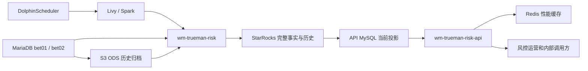
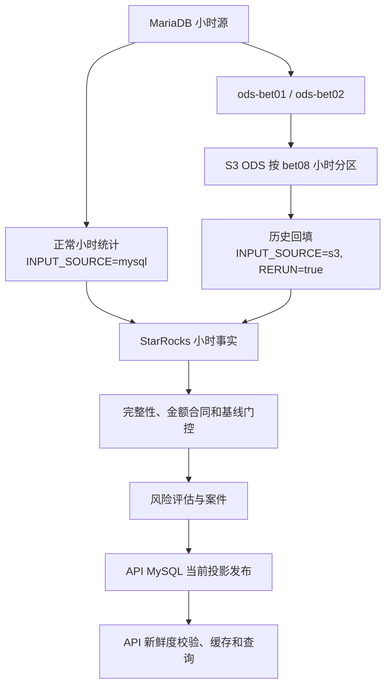
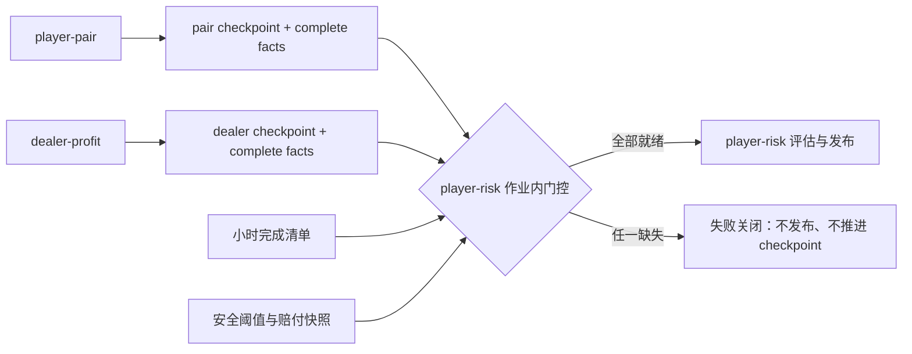
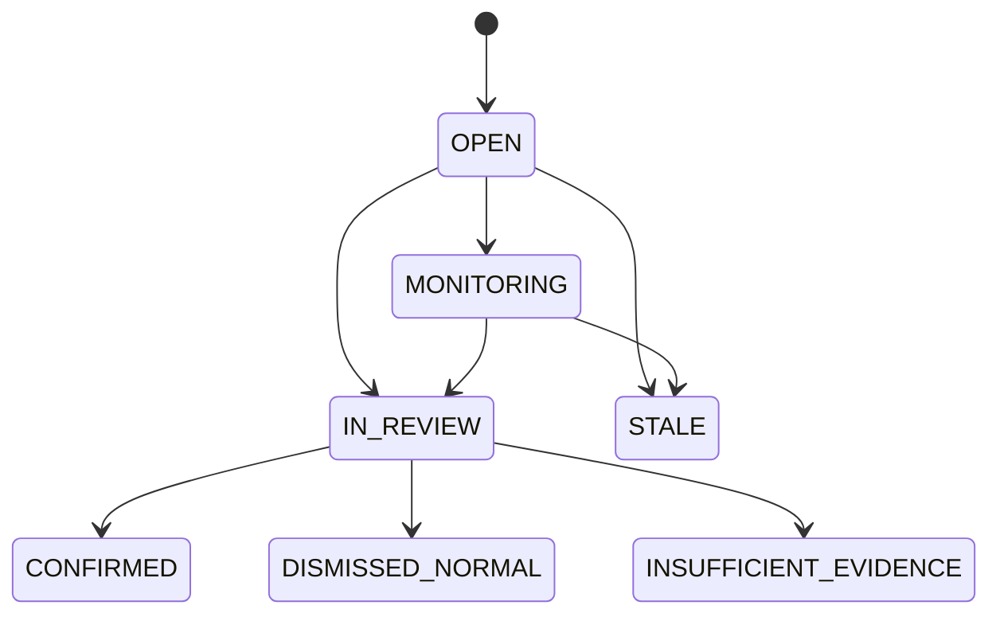
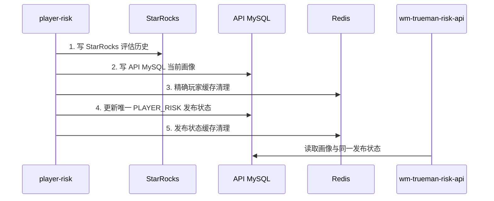
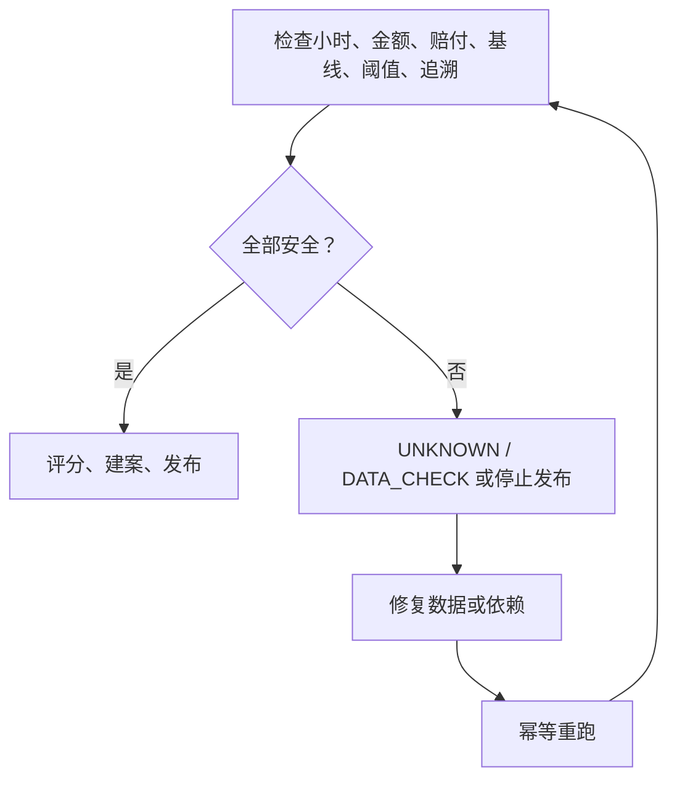

# WM Live 第一版百家乐风控系统设计

> 状态：第一版候选实现，尚未正式上线。
>
> 本文是 `wm-trueman-risk` 与 `wm-trueman-risk-api` 唯一有效的系统级设计和跨项目语义真相源。代码、DDL 和专项手册必须与本文一致；发生冲突时，应先停止发布并修正文档或实现，不能由调用方自行选择口径。
>
> 本文自包含核心合同、模型、表、流程、判级和异常处理。部署命令、完整 SQL 和 API 请求示例只在专项手册中维护，本文通过链接引用。

## 1. 文档定位与角色阅读指南

本文回答四类共同问题：系统为什么存在、数据如何变成证据、证据如何形成等级和案件、一次结果如何安全发布并可追溯。它不是接口字段大全、部署命令集合或临时分析笔记。

| 角色 | 先读 | 深入 | 读完后应能回答 |
| --- | --- | --- | --- |
| 业务风控 | 第 2、3、10～13、17 章 | 第 7、11、12、16 章 | 哪些行为只是调查线索，何时可以升级，人工可以采取什么动作，哪些结论不得宣称 |
| 研发 | 第 4～6、11、12、14 章 | 第 7～9、15、16、18 章 | API 返回的结果来自哪个快照，字段和等级如何解释，缓存与数据库怎样保持一致 |
| 数据工程 | 第 4～9、15、16 章 | 第 10、11、17～19 章 | 每个事实从哪里产生、使用什么粒度和时间窗口、怎样重跑而不重复、失败时如何关闭 |
| 运维 | 第 5、6、9、14、16、17 章 | 第 7、15、18、19 章 | 工作流依赖是什么，完成门控在哪里，如何判断数据可发布，故障后从哪里恢复 |

推荐按以下顺序使用本文：

1. 先用第 2～6 章建立共同语言和系统边界。
2. 再用第 7～9 章核对数据、表和作业。
3. 用第 10～13 章解释风险结果，不以单个指标替代正式判级。
4. 用第 14～17 章执行发布、异常处置和首次上线验收。
5. 用第 18、19 章检查当前实现证据、固定公式和专项手册。

文中的标签含义如下：

- **设计合同**：跨项目必须保持不变的语义或不变量。
- **当前实现**：代码或 DDL 已存在，但仍需生产环境验证。
- **上线配置**：可按环境或容量调整的数值，不改变业务合同。
- **上线前验证**：第一版启用前必须完成的证明。
- **后续能力**：不属于第一版，不得被描述为现有能力。

## 2. 执行摘要

第一版只处理 `bet02 = 101` 的百家乐数据，目标是识别庄闲对打、返水套利、协同自动化、相对时序异常和多账号关联。系统采用“行为 B、关系 R、经济结果 E、持续性 P”四类证据，而不是用单次大赢、高 ROI、共享 IP 或某一个统计阈值直接定罪。

离线项目 `wm-trueman-risk` 从 MariaDB `bet01`、`bet02` 读取当前数据，也可从 S3 ODS 读取已归档历史数据。它先建立可追溯的局级和玩家对事实，再在 StarRocks 中保存完整小时历史、阈值、评估和案件，最后把当前可查询结果发布到 API MySQL。`wm-trueman-risk-api` 只读取已完整发布的当前投影，并用 Redis 加速查询。

StarRocks 是小时事实、历史评估和重建的真相源；API MySQL 是可替换的当前查询投影；Redis 只是缓存。正常小时统计在 `INPUT_SOURCE=mysql` 时不依赖 S3 ODS 完成，历史回填在使用 `INPUT_SOURCE=s3` 时必须先准备所有会与统计窗口重叠的 ODS 小时分区。

玩家风险等级为 `UNKNOWN / LOW / MEDIUM / HIGH / CRITICAL`，对应数据检查、允许、监控、人工复核和建议阻断。分数表达证据强度，不是作弊概率。`HIGH` 和 `CRITICAL` 必须满足独立证据与复现门槛，辅助信号不能绕过门槛。

第一版固定 `shadowOnly = true`。系统只打标、建案、通知和提供调查材料；停优惠、限注、KYC、出款审核、冻结、封号或其他账户限制都必须由人工批准。`BLOCK_RECOMMENDED` 也是建议，不是自动执行指令。

一次可用结果必须同时满足：源小时完整、金额合同一致、阈值和赔付规则可用、事实可追溯、评估和当前投影完整发布、相关缓存失效。任何一项不安全时，结果必须失败关闭为 `UNKNOWN / DATA_CHECK` 或停止发布，不得沿用混合口径生成高等级。

## 3. 业务目标、安全边界与非目标

### 3.1 业务目标

第一版提供以下能力：

- 小时级生成百家乐行为、关系和结算事实，并能从源注单或结算行重建。
- 按玩家和团伙聚合复合证据，形成可解释的风险评估、案件和调查时间线。
- 支持第 50 手后投注、玩家对同桌率、玩家—荷官盈利异常三项业务调查 API。
- 保存模型、金额、基线和阈值快照，使历史结果能够按当时口径复核。
- 以幂等方式回填、重跑和刷新投影，不因重复执行累计放大。
- 以影子模式收集人工标签，为阈值校准和正式上线决策提供证据。

### 3.2 安全边界

- 只有数据完整且合同安全的窗口才参与正式评分。
- 单次大赢、单一高 ROI、共享 IP、特定荷官盈利、第 50 手后下注均不能单独进入 `HIGH`。
- `bet08 - bet06` 只代表开局后的相对下注延迟；没有关盘时间，不能据此断言“关盘后下注”或“偷看结果”。
- 历史分析 SQL 只能形成调查候选，不能替代正式事实和评分逻辑。
- 所有案件必须保留成员、角色、命中局、对手、IP、金额、盈亏、返水、证据时间线和源事实引用。
- 首版所有影响玩家权益的动作必须人工审批。

### 3.3 非目标与禁止宣称

第一版不做实时逐注拦截，不自动改变账户、支付或优惠状态，不训练监督式作弊概率模型，也不把 API MySQL 或 Redis 当作历史计算来源。由于尚未正式上线且没有稳定生产标签，第一版只能报告识别到的风险流水、游戏纯盈亏、返水收益和人工复核结果，不能宣称实际挽损、生产准确率或已确认作弊。

以下内容属于后续能力：自动处置、在线特征流、监督学习概率、跨游戏统一模型和闭环损失归因。除非设计合同和审批机制另行升级，否则不得在接口或运营材料中暗示这些能力已存在。

## 4. 术语、实体与固定模型合同

| 术语 | 固定定义 |
| --- | --- |
| 玩家 | 以源系统玩家 ID 标识的投注主体；同一自然人是否持有多个玩家 ID 是待调查关系，不在源层直接合并 |
| 订单 | `bet01` 或 `bet02` 中可追溯的一条源记录；同一玩家同局可以存在多条订单 |
| 局 | 规范身份 `bet03 + bet04`；`bet03 = 0` 的历史行无效 |
| 子局 / 手数 | `bet04` 表示局内手数，也是第 50 手业务规则使用的物理字段 |
| 桌台 | 精确同桌和反向下注匹配的必要维度；同一规范局号的跨桌记录不能互相匹配 |
| 荷官 | `bet02` 结算事实中的荷官维度；玩家—荷官异常只作为调查或交叉证据 |
| 信号 | 从一个确定事实粒度计算出的异常观察，例如反向下注覆盖率或严格返水闭环 |
| 证据家族 | 行为 B、关系 R、经济 E、持续性 P；同家族设置上限，避免重复特征反复加分 |
| 案件 | 某个玩家或关系网络在一个快照上的复合证据、成员、时间线和人工状态 |
| 玩家画像 | 从当前有效案件派生的 API 查询投影，不是历史真相源 |
| 阈值快照 | 一次评分实际使用的不可变阈值集合及其合同标识 |
| 发布快照 | 对外可见的一个完整 `as_of_time` 结果；不能由不同时间或合同的部分数据拼接 |
| 源事实引用 | 从信号或案件返回局级事实，并最终定位源注单或结算记录的稳定引用 |

固定模型合同：

```text
model_version = BACCARAT_ANTI_ARBITRAGE_V1
metric_contract = BET17_POCKET_NET_V3
baseline_contract = BACCARAT_AA_V1_NON_OVERLAP_90D_BET17_POCKET_NET_V3
shadowOnly = true
```

`model_version` 标识正式判级算法；`metric_contract` 标识金额语义；`baseline_contract` 标识非重叠 90 日同群体基线语义。快照只有在合同完全匹配时才能参与评分或发布。`BACCARAT_ANTI_ARBITRAGE_V1` 是第一版合同，不表示存在旧生产模型。

## 5. 总体架构、项目职责与真相源

### 5.1 项目职责

`wm-trueman-risk` 是离线计算和发布项目，拥有 ODS、小时事实、受影响键重建、校准、风险评估、案件形成及 API MySQL 投影刷新。生产统一入口是 `com.wm.risk.launcher.JobLauncher`。

`wm-trueman-risk-api` 是查询服务项目，拥有鉴权、参数校验、分页、稳定 DTO、发布新鲜度检查和 Redis 缓存。它不重新计算风险等级，不从源库补齐缺失结果，也不把缓存命中视为发布成功。

### 5.2 组件责任和故障边界

| 组件 | 所有者 | 写入内容 | 读取内容 | 是否真相源 | 失败影响 |
| --- | --- | --- | --- | --- | --- |
| MariaDB `bet01` / `bet02` | 业务源系统 | 原始投注和结算记录 | — | 原始记录真相源 | 当前小时无法读取；不得以不完整样本评分 |
| S3 ODS | `wm-trueman-risk` | 按 `bet08` 分区的原字段 Parquet | MariaDB | 历史源归档 | S3 模式回填暂停；MySQL 模式正常小时可继续 |
| StarRocks | `wm-trueman-risk` | 小时事实、完成清单、阈值、评估、案件、健康指标 | MariaDB 或 S3 ODS | 派生事实和重建真相源 | 停止评估和发布，保留旧完整 API 快照 |
| API MySQL | `wm-trueman-risk` 写、API 读 | 过滤后的当前玩家对、荷官、画像和发布状态 | StarRocks | 否，当前查询投影 | 新快照不可见；可从 StarRocks 重建 |
| Redis | `wm-trueman-risk-api` | 查询缓存 | API MySQL | 否，性能缓存 | 回源 MySQL；若失效失败则不得声称新快照已对外一致 |
| DolphinScheduler | 运维 / 数据工程 | 工作流实例和依赖状态 | 作业配置 | 调度状态记录 | 作业不启动或依赖顺序失效 |
| Livy | 运维 / 数据工程 | Spark 会话和提交状态 | 发布包、Livy JSON | 提交状态记录 | 当前 Spark 作业不执行 |
| `wm-trueman-risk-api` | 研发 | HTTP 响应和缓存 | API MySQL、Redis | 否 | 调查查询不可用，不影响 StarRocks 历史事实 |

### 5.3 系统上下文

<!-- diagram: system-context -->


数据真相按层次划分，而不是由单一数据库包办：

1. MariaDB 是源订单和结算记录的真相源。
2. S3 ODS 是原字段历史归档和历史重读来源。
3. StarRocks 是完整派生事实、评估历史和重建的真相源。
4. API MySQL 是经过筛选、可随时重建的当前查询投影。
5. Redis 不承载业务真相，只缩短查询延迟。

任何跨层对账失败都不能通过选择“看起来正确”的一层绕过。必须定位合同、窗口或发布阶段，修复后幂等重建。

## 6. 实时、历史、发布和查询数据流

### 6.1 正常小时与历史回填

<!-- diagram: realtime-and-backfill-flow -->


正常小时统计默认 `INPUT_SOURCE=mysql`，直接读取 MariaDB，因此 S3 ODS 不是它的固定前置依赖。ODS 任务仍独立归档相同源数据。只有统计任务显式使用 `INPUT_SOURCE=s3` 时，所有与 grace 扩展读取范围重叠的 ODS 小时才是硬依赖。

### 6.2 时间窗口

源读取使用有索引的 `bet08 / bet_time`，并由 `JOB_WINDOW_GRACE_MINUTES` 扩展读取范围。读取后，统计记录必须按 `bet06 / openTime` 归属到原始左闭右开小时 `[start, end)`。ODS 只覆盖目标 `bet08` 小时分区，不用 grace 扩大写入分区。

每个统计小时按以下原则处理：先读取旧受影响键，替换目标小时事实，再从所有保留小时重聚合受影响键，幂等刷新 API MySQL，并删除已经不满足候选条件的旧投影。重跑不能使用 `+=` 累计。

### 6.3 发布与查询边界

风险评估不是写入任一张表后立即可见。必须先写 StarRocks 评估历史，再写 API MySQL 玩家画像，精确失效玩家缓存，更新唯一 `PLAYER_RISK` 发布状态，最后失效发布状态缓存。只有完整序列成功，实时 checkpoint 才能前进。

API 首先判断发布状态和快照新鲜度，再返回同一发布快照中的数据。它不能把新画像、旧发布状态或旧缓存拼成一个响应。历史 `RERUN=true` 不推进实时 checkpoint，也不能覆盖更晚的 API 快照。

## 7. 数据准入、时间、金额、局身份和赔付合同

### 7.1 源表职责与字段用途

| 源 | 业务职责 | 正式作业 | 主要字段用途 |
| --- | --- | --- | --- |
| `bet01` | 投注订单与下注行为 | `ods-bet01`、`player-pair` | 玩家、下注项、金额、IP、桌台、荷官、`bet03`、`bet04`、`bet06`、`bet08`、更新时间 |
| `bet02` | 结算结果与有效流水 | `ods-bet02`、`dealer-profit` | `validbet`、`bet13`、`bet14`、`bet16`、`bet17`、汇率、玩家、桌台、荷官和结算时间 |

`bet01` 可以在同一玩家、同一局中出现多条下注行，不能直接把订单行当成玩家参与行。`bet02` 是正式金额和玩家—荷官结果的来源。`sql/analysis/` 中的查询只能形成供人工核验的调查候选，不得直接成为正式评分输入。

### 7.2 数据准入

所有正式事实必须满足以下共同条件：

- 物理游戏字段 `bet02 = 101`，只处理百家乐。
- 排除取消、无效和被重结替代的记录；同一源主键的当前有效状态只能贡献一次。
- 历史数据中 `bet03 = 0` 的行无效。
- 金额记录必须有正 `bet11` 汇率；零、负数或缺失汇率不参与金额聚合，并进入质量统计。
- 局、玩家、下注项等业务字段必须能够形成目标事实主键；关键字段缺失时不生成猜测值。
- ODS 保持源字段，不在归档层重新解释结算口径。

取消和重结状态必须按源系统当前有效语义过滤；如无法可靠区分，相关小时不得被标记为完整。不能通过“保留全部再相加”或“选择金额较大的一行”规避状态不确定性。

### 7.3 读取窗口与归属窗口

源读取使用有索引的 `bet08 / bet_time`，窗口是 grace 扩展后的左闭右开区间。记录读入后，以 `bet06 / openTime` 决定是否属于原始统计小时 `[start, end)`。二者职责不同：

- `bet08` 解决增量读取和迟到数据发现。
- `bet06` 解决业务事实属于哪个开局小时。

例如目标小时为 `[10:00, 11:00)`，grace 为 3 分钟，源读取可以覆盖 `[09:57, 11:03)`；只有 `openTime >= 10:00` 且 `< 11:00` 的记录写入该小时事实。恰好 `11:00` 的记录属于下一小时。ODS 写入仍只触碰对应的精确 `bet08` 小时分区，不按 grace 扩写分区。

统一业务快照使用明确的 `as_of_time` 和左闭右开观察窗口。`bet08 - bet06` 只表示开局后的相对下注延迟；系统没有关盘时间，不能据此推断关盘后下注、偷看结果或其他作弊结论。

### 7.4 局身份、去重与桌台证据

规范局身份为 `bet03 + bet04`。`RoundBuilder` 在局和玩家粒度去重，优先保留最新 `updatetime`，再以源 `betId` 决定稳定顺序。玩家对必须先对参与玩家去重、排序，再只生成 `A < B`，不得出现 `A,A` 或反向重复。

庄闲相反下注先按“局、桌台、玩家、下注项”聚合正数本金，再形成精确玩家对事实。跨桌记录不能组成同桌或相反下注证据。同一玩家对、同一规范局号即使有多条订单、两个相反方向组合或多个桌台证据，最终 `opposite_round_count` 最多增加 1。

### 7.5 金额合同

所有金额均为玩家视角，并按正汇率 `bet11` 归一化：

```text
game_pnl = (bet14 - bet13) / bet11
rebate = bet16 / bet11
total_net_earnings = bet17 / bet11
settlement_profit = game_pnl + rebate
reconciliation_delta = total_net_earnings - settlement_profit
```

| 指标 | 含义 | 不得混淆为 |
| --- | --- | --- |
| `game_pnl` | 下注本金与派彩总额形成的盘面纯盈亏，已含游戏抽水，不含返水 | 账户实际净变动、平台利润 |
| `rebate` | 基于有效流水额外返还的洗码返水 | 盘面派彩 |
| `total_net_earnings` | `bet17` 表示的玩家口袋/账户实际净变动 | 仅盘面输赢 |
| `settlement_profit` | 由 `game_pnl + rebate` 推导的预期账户净变动 | 额外利润或平台利润 |
| `reconciliation_delta` | `bet17` 口径与组成项推导值的差额 | 可参与 ROI 的收益 |

数值例：玩家下注 100，庄赢净赢 95，返水 0.8，汇率为 1。则 `bet13 = 100`、`bet14 = 195`、`game_pnl = 95`、`rebate = 0.8`、`settlement_profit = 95.8`。若 `bet17 = 95.8`，则 `total_net_earnings = 95.8`、`reconciliation_delta = 0`。如果玩家输掉本金，`bet14 = 0`，盘面 `game_pnl = -100`；返水仍单独进入账户净变动。

`profit` 在荷官事实中固定表示正式 `game_pnl`，不是 `bet17`。新结算事实使用 `metric_contract = BET17_POCKET_NET_V3`；滚动特征、投影和玩家风险只消费完全匹配的合同。

### 7.6 对账与赔付规则

`settlement_profit` 用来检查组成项是否与 `bet17` 一致。`abs(reconciliation_delta)` 超出配置容差时，该记录或小时进入数据质量处理；系统不得退回旧公式、改用 `bet14 - bet13` 代替 `bet17`，也不得在同一快照混用合同。

佣金模式、下注项和开奖结果对应的理论赔付必须能匹配有效 `baccarat_payout_rule`。规则缺失、冲突或版本不适用于该小时，经济证据不安全：评估失败关闭为 `UNKNOWN / DATA_CHECK` 或停止发布，而不是猜测默认赔付。

## 8. 数据模型、表清单与表级血缘

### 8.1 分层原则

第一版风险模型库存是九张小时事实/完成表、七张风险生命周期表和 `player_risk_refresh_key`，合计 17 张物理模型/控制表，另有两个逻辑视图。API MySQL 的当前投影不计入这 17 张表。表卡统一说明“来源、粒度、写入者、消费者、真相源和不变量”，避免仅凭表名猜测语义。

### 8.2 源与 ODS

| 表名 | 存储 | 来源 | 主键/粒度 | 写入者 | 消费者 | 真相源 | 关键不变量 |
| --- | --- | --- | --- | --- | --- | --- | --- |
| `bet01` | MariaDB | 投注业务 | 源订单 | 业务源系统 | ODS、玩家对统计 | 原始投注真相源 | 同玩家同局允许多注；以 `bet08` 增量读取 |
| `bet02` | MariaDB | 结算业务 | 源结算记录 | 业务源系统 | ODS、荷官收益统计 | 原始结算真相源 | 正式金额字段和 `bet02 = 101` 过滤 |
| `ods-bet01` | S3 Parquet | `bet01` | `bet_date/bet_hour` 分区内源行 | `ods-bet01` | S3 历史 `player-pair` | 历史源归档 | 源字段不变；重跑先替换触碰分区 |
| `ods-bet02` | S3 Parquet | `bet02` | `bet_date/bet_hour` 分区内源行 | `ods-bet02` | S3 历史 `dealer-profit` | 历史源归档 | 分区由 `bet08` 生成；空小时可安全完成 |

### 8.3 九张 StarRocks 小时事实与完成表

| 表名 | 存储 | 来源 | 主键/粒度 | 写入者 | 消费者 | 真相源 | 关键不变量 |
| --- | --- | --- | --- | --- | --- | --- | --- |
| `player_pair_stat_hourly` | StarRocks | `player-pair` 聚合 | 小时、规范玩家对 `A < B` | `player-pair` | 玩家对累计重建 | 小时关系统计 | 含 `opposite_round_count`；小时重跑替换 |
| `player_round_stat_hourly` | StarRocks | 去重玩家参与 | 小时、玩家 | `player-pair` | 同桌率分母和累计投影 | 小时玩家参与统计 | 同玩家同局最多计一次 |
| `dealer_profit_stat_hourly` | StarRocks | `bet02` 结算 | 小时、荷官、游戏、玩家 | `dealer-profit` | 荷官累计投影、玩家风险 | 小时结算聚合 | `profit = game_pnl`；只用 V3 合同 |
| `baccarat_player_round_option_hourly` | StarRocks | `bet01` | 小时、局、桌、玩家、荷官、模式、下注项 | `player-pair` | 局级行为和证据 | 最细下注项事实 | 同粒度先聚合多注；保留 `OTHER` 和源引用 |
| `baccarat_player_round_hourly` | StarRocks | 下注项事实 | 小时、局、桌、玩家、荷官、模式 | `player-pair` | 30/90 日特征、同桌关系 | 玩家局级事实 | 玩家局去重；跨桌不合并证据 |
| `baccarat_pair_round_hourly` | StarRocks | 玩家局与下注项事实 | 小时、局、桌、规范玩家对 | `player-pair` | 反向下注和关系评分 | 精确玩家对局事实 | 正数匹配本金；`A < B`；保留源引用 |
| `baccarat_automation_group_round_hourly` | StarRocks | 下注项事实 | 小时、协同组键 | `player-pair` | 自动化协同信号 | 局级协同事实 | 只消费正式下注侧，不把 `OTHER` 当协同证据 |
| `baccarat_player_round_settlement_hourly` | StarRocks | `bet02` 结算 | 小时、局、桌、玩家、荷官、模式 | `dealer-profit` | 经济特征、对账、玩家风险 | 玩家局结算事实 | `metric_contract = BET17_POCKET_NET_V3` |
| `baccarat_fact_hour_completion` | StarRocks | 事实写入结果 | 小时、`source_name` | 统计作业 | `player-risk` 门控、健康检查 | 完成状态真相源 | 只有对应事实完整成功才写完成 |

`player_pair_stat_hourly` 的相反下注局数来自 `baccarat_pair_round_hourly`，先按 `(player_a, player_b, round_key)` 去重，再汇总为小时值。任何时刻都必须满足：

```text
0 <= opposite_round_count <= same_round_count
```

### 8.4 七张风险生命周期表与刷新键

| 表名 | 存储 | 来源 | 主键/粒度 | 写入者 | 消费者 | 真相源 | 关键不变量 |
| --- | --- | --- | --- | --- | --- | --- | --- |
| `player_risk_assessment_hourly` | StarRocks | 完整小时事实、阈值和基线 | 评估小时、玩家 | `player-risk` | 案件、画像、审计 | 评估历史真相源 | 保存 B/R/E/P、原因和全部合同 |
| `baccarat_payout_rule` | StarRocks | 经审批的赔付配置 | 规则版本、玩法、佣金、下注侧、结果 | 校准/治理流程 | 结算一致性和经济证据 | 赔付规则真相源 | 缺失时失败关闭 |
| `baccarat_risk_threshold_snapshot_daily` | StarRocks | 每日校准 | 基线日期、快照 ID | 校准作业 | `player-risk` | 阈值快照真相源 | 不可变、可追溯、合同唯一 |
| `baccarat_risk_threshold_value_daily` | StarRocks | 阈值快照 | 日期、快照 ID、指标名 | 校准作业 | `player-risk` | 阈值明细真相源 | 数值与边界运算符分离 |
| `baccarat_risk_case_hourly` | StarRocks | 玩家评估和关系证据 | 案件小时、案件 ID | `player-risk` | 案件投影、复核和画像 | 案件历史真相源 | 记录成员、时间线、快照和事实引用 |
| `baccarat_risk_run_health_hourly` | StarRocks | 作业与模型质量 | 评估小时、健康键 | `player-risk` / 健康任务 | 运维和发布门控 | 运行健康历史 | 数据不安全原因必须显式 |
| `baccarat_risk_review_metrics_daily` | StarRocks | 人工复核结果 | 复核日期、指标键 | 复核指标任务 | 校准和上线验收 | 复核指标历史 | 标签口径稳定、去重案件 |
| `player_risk_refresh_key` | StarRocks | 受影响玩家识别 | 刷新批次、玩家 | `player-risk` | 当前画像增量刷新 | 刷新控制真相源 | 只控制本次受影响键，不替代评估历史 |

### 8.5 两个逻辑视图

| 表名 | 存储 | 来源 | 主键/粒度 | 写入者 | 消费者 | 真相源 | 关键不变量 |
| --- | --- | --- | --- | --- | --- | --- | --- |
| `v_baccarat_player_subround_order_hourly` | StarRocks 视图 | 下注项小时事实 | 小时、子局、订单调查粒度 | DDL | 第 50 手业务查询 | 否，逻辑投影 | 动态使用手数阈值，不物化晚靴汇总表 |
| `v_baccarat_settlement_reconciliation_hourly` | StarRocks 视图 | 玩家局结算小时事实 | 小时、结算对账粒度 | DDL | 金额质量和验收 | 否，逻辑投影 | 统一 V3 对账口径 |

### 8.6 四张 API MySQL 当前投影

| 表名 | 存储 | 来源 | 主键/粒度 | 写入者 | 消费者 | 真相源 | 关键不变量 |
| --- | --- | --- | --- | --- | --- | --- | --- |
| `player_pair_stat` | API MySQL | 全部保留的玩家对小时统计 | 规范玩家对 | `player-pair` | 玩家关系和 Top 对 API | 否，过滤当前投影 | 含 `opposite_round_count`；候选筛选后保存 |
| `dealer_profit_stat` | API MySQL | 全部保留的荷官小时统计 | 荷官、游戏、玩家 | `dealer-profit` | 荷官异常 API | 否，过滤当前投影 | 预留 `risk_score = 0`、`risk_level = UNKNOWN` 不参与判级 |
| `player_risk_profile` | API MySQL | 当前有效案件和最新评估 | 玩家 | `player-risk` | `/profile`、`/assessment` | 否，当前画像 | 只接受完整且不旧于已发布快照的结果 |
| `player_risk_publish_state` | API MySQL | 发布事务阶段 | 数据集名称 | `player-risk` | API 新鲜度门控 | 当前发布边界 | 唯一 `PLAYER_RISK` 行标识完整快照 |

`player_pair_stat` 与 `dealer_profit_stat` 都是筛选后的当前投影，不是完整历史。重跑时必须从 StarRocks 小时事实重新聚合并 upsert，同时删除不再满足条件的旧行。

### 8.7 库存外资产和禁止回归

`job_checkpoint`、通用刷新键和 StarRocks 离线累计投影属于运行控制或可重建投影，不计入 17 张风险模型表。API MySQL 中为三项业务监控和案件查询维护的服务投影也不改变上述事实库存边界。

已经被局级事实或逻辑视图替代的行为汇总、结算汇总和晚靴物理表不得重新创建或写入。任何新增物理表必须说明不可由现有事实安全派生的理由，并同步更新本文、canonical DDL、跨仓库契约测试和清理策略。

## 9. 作业、工作流、完成门控与重跑设计

### 9.1 生产入口和五条小时工作流

所有 Spark 生产作业只使用入口 `com.wm.risk.launcher.JobLauncher`，并通过以下 `--job` 值选择逻辑：

| 工作流 | 作业参数 | 默认来源 | 产物 | 直接依赖 |
| --- | --- | --- | --- | --- |
| `wm-risk-ods-bet01-hourly` | `ods-bet01` | MariaDB `bet01` | S3 `ods-bet01` | MariaDB 可读 |
| `wm-risk-ods-bet02-hourly` | `ods-bet02` | MariaDB `bet02` | S3 `ods-bet02` | MariaDB 可读 |
| `wm-risk-player-pair-hourly` | `player-pair` | MariaDB `bet01` | 行为、玩家对及协同小时事实和关系投影 | 来源可读、StarRocks/API MySQL 可写 |
| `wm-risk-dealer-profit-hourly` | `dealer-profit` | MariaDB `bet02` | 结算、荷官小时事实和荷官投影 | 来源可读、金额合同安全 |
| `wm-risk-player-risk-hourly` | `player-risk` | StarRocks 完整事实 | 评估、案件、画像、发布状态 | 上游小时、阈值、合同和质量门控全部通过 |

五条工作流独立调度。统计默认 `INPUT_SOURCE=mysql` 时，`player-pair` 和 `dealer-profit` 不等待 ODS 工作流；显式使用 `INPUT_SOURCE=s3` 时，相关 ODS 小时分区成为硬依赖。不得因为工作流名称相邻而虚构调度依赖。

### 9.2 小时窗口和替换式刷新

统计作业把多小时范围拆为单个小时。源查询以 `bet08` 读取，并使用可配置的 `JOB_WINDOW_GRACE_MINUTES`；业务归属仍按 `bet06 / openTime` 限定到原始半开小时。每小时严格执行：

1. 从 StarRocks 读取该小时原有事实涉及的旧受影响键。
2. 删除目标小时快照。
3. 写入重新计算的新小时快照及完成状态。
4. 合并旧键与新键，从所有保留小时事实重聚合这些键。
5. upsert 仍满足条件的 API MySQL 当前投影。
6. 删除已不满足候选条件或已从源事实消失的投影行。

因此旧事实被修正或删除时，累计值可以回退。重跑同一小时不会增加计数。`player_pair_stat` 的推荐小时刷新范围是 `PLAYER_PAIR_REFRESH_SCOPE=direct`，只重建当前窗口直接改变的玩家对；`player` 模式会刷新相关玩家的全部配对，用于严格分母传播或周期性再校准，代价是更大的历史扫描。

### 9.3 player-risk 完成门控

`player-risk` 只读取标记完整的 StarRocks 小时事实，计算 24 小时、7 日和 30 日滚动特征。作业内必须同时验证：

- 玩家对/行为事实与结算事实覆盖目标 `as_of_time`。
- 两条上游统计 checkpoint 不落后于目标窗口。
- `baccarat_fact_hour_completion` 中必需来源均完整。
- 结算事实的 `metric_contract` 完全为 V3。
- 校准行的 `baseline_contract` 完全匹配模型要求。
- 有安全且适用于目标时间的赔付规则和阈值快照。
- 关键数据质量指标没有触发失败关闭。

<!-- diagram: workflow-and-gates -->


门控失败不能通过空值补零或读取旧合同绕过。该小时写入健康原因，保留最后一个完整 API 快照，修复上游后从未完成窗口重跑。

### 9.4 checkpoint、显式窗口和历史重跑

统计作业使用 `job_checkpoint`，ODS 作业不使用：

- `RERUN=true`：必须显式给出 `START_TIME` 和 `END_TIME`；只替换目标小时并重建受影响键，不读取也不推进实时 checkpoint，不覆盖更晚的 API 快照。
- `RERUN=false` 且显式 `START_TIME`：使用给定窗口，全部小时成功后把 checkpoint 推进到 `END_TIME`。
- `RERUN=false` 且没有 `START_TIME`：以上次成功 checkpoint 为起点，成功后推进。

历史回填包装脚本的 `_backfill_state` 只记录已完成分段，Spark 作业不读取它。失败后从最近完成分段继续，不能删除完整事实或状态文件来伪造成功。

### 9.5 校准和健康报告

每日校准基于完整的历史自然日生成不可变阈值快照；运行健康和复核指标分别记录小时安全状态及每日人工标签质量。它们为小时 `player-risk` 提供可用性判断和上线证据，但本文不规定代码中尚不存在的调度边。实际 DolphinScheduler 依赖必须以部署工作流和完成门控共同验证。

## 10. 五类风险信号与辅助调查信号

### 10.1 信号共同合同

每个信号都必须回答同一组问题：

```text
业务问题 | 输入事实 | 特征与公式 | 样本门槛 | 中等/强条件 |
B/R/E/P 归属 | 家族封顶 | 最高等级 | 正常反例 | 输出事实引用
```

阈值来自本次评估记录的不可变快照；样本数、金额和分位阈值必须同时满足。信号输出不仅保存布尔命中，还保存观察值、阈值、窗口、同群体、合同、命中局和源事实引用。正式信号家族及其定位如下。

### 10.2 `HEDGE_ARBITRAGE`：跨账号庄闲对打

| 项目 | 合同 |
| --- | --- |
| 业务问题 | 两个或多个账号是否通过同局庄闲相反下注降低盘面风险，并利用返水或其他经济结果获利 |
| 输入事实 | `baccarat_pair_round_hourly`、玩家局事实、结算事实、玩家对累计和关系网络 |
| 特征与公式 | 相反下注局数、`opposite_round_count / same_round_count`、正数匹配本金、金额覆盖率、剩余净敞口、下注时间差、团队 `game_pnl/rebate/total_net_earnings` |
| 样本门槛 | 玩家对共同局数、相反局数、匹配本金和独立小时均达到快照最低值 |
| 中等/强条件 | 按 P99/P99.5 与绝对门槛区分；强行为仍需关系、经济和持续性硬门槛才能升级 |
| B/R/E/P 归属 | 对打强度进入 B；跨账号同桌、明确反向关系进入 R；返水后收益和低敞口进入 E；复现进入 P |
| 家族封顶 | 行为特征在 B 内取最高强度，不把覆盖率、敞口和同步性重复累加 |
| 最高等级 | 复合证据完整时可到 `CRITICAL` |
| 正常反例 | 偶然同桌、少量相反下注、活动玩法造成的单局分散下注、同一玩家自对冲 |
| 输出事实引用 | 玩家对、局号、桌台、双方下注侧、本金、匹配本金、时间、结算和源订单 |

相反下注必须有精确桌台证据和正数匹配本金。`SELF_HEDGE` 表示同一玩家同局内的自对冲，只是行为调查标签，不能提供跨账号 R，最高为 `MEDIUM`。

### 10.3 `REBATE_WASH`：洗码返水套利

| 项目 | 合同 |
| --- | --- |
| 业务问题 | 玩家是否持续以高有效流水、低盘面暴露换取足以覆盖盘面亏损的返水 |
| 输入事实 | V3 玩家局结算、有效流水、赔付规则、玩家滚动结算特征及关系证据 |
| 特征与公式 | `abs(game_pnl) / valid_bet`、`rebate / valid_bet`、`total_net_earnings`、跨日累计和严格返水闭环 |
| 样本门槛 | 正有效流水、最低局数/金额、完整结算小时和安全对账 |
| 中等/强条件 | 低盘面盈亏率和返水后净收益按同群体分位与绝对金额共同判断 |
| B/R/E/P 归属 | 流水和低暴露模式进入 B；账号关系进入 R；闭环收益进入 E；跨小时/日复现进入 P |
| 家族封顶 | 多个返水比例和 ROI 特征在 B/E 各自取最高强度 |
| 最高等级 | 严格闭环满足 HIGH；再具备跨账号关系和 CRITICAL 硬门槛时可到 `CRITICAL` |
| 正常反例 | 一次小额返水覆盖偶然亏损、正常高流水玩家、单次净赢或样本不足 |
| 输出事实引用 | 玩家、局、有效流水、盘面盈亏、返水、口袋净收益、合同和结算源行 |

严格返水闭环必须同时满足：

```text
valid_bet > 0
game_pnl <= 0
rebate > abs(game_pnl)
total_net_earnings > 0
```

这是经济闭环，不等于已确认套利；仍需样本、安全数据和持续性。

### 10.4 `COORDINATED_AUTOMATION`：协同或自动化嫌疑

| 项目 | 合同 |
| --- | --- |
| 业务问题 | 多账号是否在重复局中呈现异常同步的下注项、时间和金额模式 |
| 输入事实 | `baccarat_automation_group_round_hourly`、下注项事实、玩家局和关系网络 |
| 特征与公式 | 同步下注次数、延迟差、重复金额桶/序列、共同局覆盖、参与玩家数和跨小时复现 |
| 样本门槛 | 最低成员数、局数、同步次数和独立小时 |
| 中等/强条件 | 与同桌、同玩法、相近时段同群体比较 P99/P99.5 |
| B/R/E/P 归属 | 重复协同行为进入 B；共同局和账号连接进入 R；本信号本身不制造 E；复现进入 P |
| 家族封顶 | 多种同步特征在行为家族内封顶 |
| 最高等级 | 独立最高 `MEDIUM`；只能作为其他正式家族的交叉证据 |
| 正常反例 | 热门固定金额、同一代理带来的相似习惯、一次网络批量到达 |
| 输出事实引用 | 协同组、成员、局、桌台、下注项、金额桶、时间和源订单 |

### 10.5 `RELATIVE_TIMING_OUTCOME_ANOMALY`：相对时序与结果异常

| 项目 | 合同 |
| --- | --- |
| 业务问题 | 玩家在可比较群体中是否长期处于异常靠后的相对下注时序，并伴随结果偏离 |
| 输入事实 | 下注项/玩家局事实、同桌同玩法相近时段基线和结算事实 |
| 特征与公式 | `bet08 - bet06` 相对延迟分位、后段下注占比、胜率/ROI 偏离和跨日持续性 |
| 样本门槛 | 同群体和玩家最低局数，且时钟、窗口与结算完整 |
| 中等/强条件 | 延迟和结果分别达到快照分位与绝对样本门槛 |
| B/R/E/P 归属 | 相对时序进入 B；本身不提供 R；结果偏离可提供有限 E；复现进入 P |
| 家族封顶 | 延迟、后段占比和时序分位在行为家族内封顶 |
| 最高等级 | 独立最高 `MEDIUM` |
| 正常反例 | 慢速手动玩家、网络延迟、特定桌节奏、少量高胜率样本 |
| 输出事实引用 | 玩家、局、桌台、玩法、下注/开局时间、群体分位和结算 |

该信号始终命名为“相对时序异常”。由于没有关盘时间，绝不宣称关盘后下注、抢跑或偷看结果。

### 10.6 `MULTI_ACCOUNT_LINK`：多账号关系

| 项目 | 合同 |
| --- | --- |
| 业务问题 | 玩家 ID 之间是否存在可重复、可解释的行为或网络关系 |
| 输入事实 | IP—玩家、同桌同局、相反下注、同步组和案件成员关系 |
| 特征与公式 | 共享 IP 次数、共同局率、相反局数、同步局数、关系复现小时/天数 |
| 样本门槛 | 每种边分别满足最小观测量；共享 IP 不替代精确局证据 |
| 中等/强条件 | 明确相反或同步关系强于仅共享 IP，阈值按关系类型分别校准 |
| B/R/E/P 归属 | 主要进入 R；关系自身不生成经济 E；关系复现影响 P |
| 家族封顶 | 多条关系边在 R 上限 20 内合并，防止同一共同局重复加分 |
| 最高等级 | 独立最高 `MEDIUM`；作为对打/返水案件的 R 时参与其硬门槛 |
| 正常反例 | 网吧、家庭、办公室、代理出口或移动 NAT 造成的共享 IP |
| 输出事实引用 | 关系类型、玩家对、IP、共同局、桌台、相反/同步事实及时间线 |

共享 IP 单独只能作为弱关系证据，不能建立团伙结论。

### 10.7 辅助调查信号

玩家—荷官或桌台收益集中、第 50 手后投注、一般高胜率、单次高 ROI、单次大赢和 `SELF_HEDGE` 都属于调查信号。它们可以帮助排序、解释或交叉验证，但不得单独突破 `MEDIUM` 上限，也不得绕过 HIGH/CRITICAL 硬门槛。

## 11. B/R/E/P 评分、判级算法与动作映射

### 11.1 分项和总分

```text
B = 0..25
R = 0..20
E = 0..25
P = 0 | 10 | 20 | 30
raw_score = min(100, B + R + E + P)
```

B 是行为证据，R 是跨账号关系证据，E 是经济结果证据，P 是持续性。一个复现小时为 10，至少两个独立小时为 20，至少三个自然日且至少三个复现小时为 30。同一信号家族内多个相关特征先取最高强度或按家族规则封顶，再进入 B/R/E；不能通过换特征名称重复加分。

### 11.2 有序决策算法

1. **数据安全准入**：验证完整小时、V3 金额合同、对账、赔付规则、阈值/基线、样本和源事实引用。失败立即输出 `UNKNOWN / DATA_CHECK`，发布分为 0。
2. **信号评分**：按本次阈值快照计算每个信号，中等/强命中分别形成解释，并执行同家族封顶。
3. **关系与经济证据**：区分共享 IP 弱边、精确同局边和明确反向/同步边；经济证据只使用安全 V3 结算。
4. **持续性**：按独立小时和自然日计算 P，不能用同小时重复事件冒充复现。
5. **原始总分**：计算 `raw_score`，保留分项和被封顶原因。
6. **硬门槛**：即使分数足够，也必须检查家族、跨账号关系、经济结果和持续性要求。
7. **最终动作**：输出等级、动作、原因码、模型/阈值快照和证据引用。影子模式只给建议。

### 11.3 UNKNOWN、LOW 和 MEDIUM

| 条件 | 最终结果 | 说明 |
| --- | --- | --- |
| 数据或样本不安全 | `UNKNOWN / DATA_CHECK` | 不把缺失当作低风险；对外发布分为 0 |
| 数据安全且 `raw_score < 25` | `LOW / ALLOW` | 当前没有足够复合证据 |
| 数据安全且 `raw_score >= 25`，但不满足任一 HIGH 硬门槛 | `MEDIUM / MONITOR` | 包括单一强信号、两个不同家族中等信号或辅助信号上限 |

### 11.4 HIGH 硬门槛

| 正式路径 | 必须同时满足 | 最终结果 |
| --- | --- | --- |
| 庄闲对打 | 跨账号关系成立；不是 `SELF_HEDGE`；`B >= 20`、`R >= 15`、`E >= 5`、`P >= 20`、`raw_score >= 75` | `HIGH / REVIEW` |
| 返水套利 | 严格返水闭环；`B >= 20`、`E >= 20`、`P = 30`；至少三个自然日；`raw_score >= 75` | `HIGH / REVIEW` |

“至少两个独立信号家族”由硬门槛中的 B/R/E/P 组合保证。辅助家族不具有独立 HIGH 路径。

### 11.5 CRITICAL 硬门槛

只有庄闲对打或具备严格返水闭环的返水套利可以进入 `CRITICAL`，并且必须同时满足：

```text
跨账号关系成立
B >= 20
R >= 15
E >= 20
P = 30
至少三个自然日
raw_score >= 90
```

最终结果为 `CRITICAL / BLOCK_RECOMMENDED`。`BLOCK_RECOMMENDED` 仍只供人工复核，不触发自动冻结、拦款或封号。

### 11.6 分数解释

分数是“当前合同下的证据强度”，不是作弊概率、损失概率或处置置信度。两个玩家同为 75 分，可能来自不同家族和不同硬门槛；调用方必须同时读取等级、原因、信号家族和证据引用。

### 11.7 四个完整算例

#### 案例 A：单次大赢

| 项目 | 值 |
| --- | --- |
| 输入事实 | 玩家在 100 局内单次出现很高盈利；无共同账号关系，只有一个观察小时 |
| 命中信号 | 只命中一次性经济异常调查标签 |
| B / R / E / P | `0 / 0 / 25 / 0` |
| 原始分 | `raw_score = 25` |
| 硬门槛检查 | 无对打 B/R/P，无严格返水闭环 |
| 最终等级 | `MEDIUM / MONITOR` |
| 建议动作 | 继续观察后续结算和关系，不建立高等级团伙结论 |
| 不能得出的结论 | 不能因单次大赢或单一高 ROI 认定套利、荷官勾结或作弊 |

#### 案例 B：共享 IP

| 项目 | 值 |
| --- | --- |
| 输入事实 | 两个玩家多次使用同一出口 IP，但没有同局、相反下注或同步下注证据 |
| 命中信号 | `MULTI_ACCOUNT_LINK` 弱关系边 |
| B / R / E / P | `0 / 5 / 0 / 0` |
| 原始分 | `raw_score = 5` |
| 硬门槛检查 | R 未达到门槛，B/E/P 均缺失 |
| 最终等级 | `LOW / ALLOW`，保留弱调查标签 |
| 建议动作 | 只有出现精确共同局或经济闭环后才扩展调查 |
| 不能得出的结论 | 不能把 NAT、家庭、办公室或代理出口认定为同一自然人或团伙 |

#### 案例 C：持续庄闲对打

| 项目 | 值 |
| --- | --- |
| 输入事实 | 跨账号玩家对在多个精确同桌局重复庄闲相反下注，低剩余敞口，两个独立小时复现，并有团队经济结果 |
| 命中信号 | `HEDGE_ARBITRAGE` 强行为和 `MULTI_ACCOUNT_LINK` 明确反向关系 |
| B / R / E / P | `25 / 20 / 10 / 20` |
| 原始分 | `raw_score = 75` |
| 硬门槛检查 | 跨账号、非 `SELF_HEDGE`；B/R/E/P 和 75 分门槛全部满足 |
| 最终等级 | `HIGH / REVIEW` |
| 建议动作 | 建立或合并团伙案件，进入人工复核队列 |
| 不能得出的结论 | 尚未达到三自然日和 E>=20，不能升级 CRITICAL，也不能自动限制账号 |

#### 案例 D：严格返水闭环

| 项目 | 值 |
| --- | --- |
| 输入事实 | `valid_bet > 0`、`game_pnl <= 0`、`rebate > abs(game_pnl)`、`total_net_earnings > 0`，跨三个自然日复现，并有明确跨账号关系 |
| 命中信号 | `REBATE_WASH` 严格闭环和 `MULTI_ACCOUNT_LINK` |
| B / R / E / P | `25 / 20 / 25 / 30` |
| 原始分 | `raw_score = 100` |
| 硬门槛检查 | 跨账号、严格闭环、B/R/E/P、三自然日和 90 分门槛全部满足 |
| 最终等级 | `CRITICAL / BLOCK_RECOMMENDED` |
| 建议动作 | 所有候选进入人工复核；由授权人员决定优惠、KYC 或出款审核 |
| 不能得出的结论 | 不能把建议直接执行为冻结、封号，也不能在人工结论前宣称已确认套利 |

## 12. 案件、团伙、人工复核与玩家画像

### 12.1 案件身份和内容

系统先形成案件，再从当前有效案件派生玩家画像。案件 ID 基于稳定的主体/团伙和信号路径，不以单次运行随机生成。一个案件至少保存：

- 主玩家、所有成员、成员角色和规范玩家对。
- 正式信号家族、调查标签、关联案件和团伙网络摘要。
- 命中局、桌台、荷官、对手、IP、下注项、金额、时间和源订单/结算引用。
- `game_pnl`、`rebate`、`total_net_earnings`、`reconciliation_delta` 及金额合同。
- B/R/E/P、原始分、发布分、当前等级、峰值等级、动作和硬门槛检查。
- 模型、基线、赔付规则、阈值快照 ID、首次发现、最后证据和 `as_of_time`。

同一或高度重叠团伙在七日窗口内合并更新，追加新的小时证据并保留等级时间线；不能每天制造一个无法串联的新案件。案件合并必须保留成员变化和事实引用，不能只覆盖最新摘要。

### 12.2 案件生命周期

<!-- diagram: case-lifecycle -->


`OPEN` 是新建未分派；`MONITORING` 是等待复现；`IN_REVIEW` 是人工处理中；三个复核终态分别表示确认套利、明确正常和证据不足；长期没有新证据的开放案件可进入 `STALE`。重新出现的新证据必须按合并合同恢复或关联，而不是抹去旧状态。

### 12.3 人工标签与队列容量

人工复核标签固定为：

- `CONFIRMED_ARBITRAGE`
- `ENHANCED_DUE_DILIGENCE`
- `NORMAL_BEHAVIOR`
- `INSUFFICIENT_EVIDENCE`

所有 `CRITICAL` 候选进入队列。`HIGH` 按证据置信度排序，每日最多接纳 20 个新案件，运营目标为每日 10～20 个；容量不改变离线风险等级。超出容量的 HIGH 进入积压队列并保留原始优先级和新证据更新。

### 12.4 玩家画像

画像从当前未关闭案件中选择玩家最高有效等级，携带主案件、信号代码、分项得分、峰值等级、活动案件数和同一 `as_of_time`。`/assessment` 给业务判级，`/profile` 给调查明细。`dealer_profit_stat` 中预留的 `risk_score = 0`、`risk_level = UNKNOWN` 不能参与玩家最终判级、筛选、排序或告警。

## 13. 三项业务监控需求与正式评分的关系

三项接口均只接收 `bet02 = 101` 的百家乐事实，使用明确的 `as_of_time`。数值阈值可配置并进入配置快照，边界运算符是固定合同。

### 13.1 第 50 手及之后投注

```text
bet04 >= lateShoeHandFloor
late_order_rate >= lateShoeMinOrderRate
late_order_count > lateShoeMinOrderCount
```

默认业务意图是手数不小于 50、晚段订单占比不小于 70%、晚段订单数严格大于 100。输出至少包含 `uid`、投注比例 `late_order_rate` 和满足手数条件的订单数 `late_order_count`，并返回观察窗口和快照时间。该指标说明投注集中在牌靴后段，不说明关盘后下注。

### 13.2 玩家对同桌率

```text
same_rate >= sameTableMinRate
same_round_count > sameTableMinOrderCount
```

默认业务意图是同桌率不小于 30%、同桌局/订单口径计数严格大于 100。输出至少包含 `uid1`、`uid2`、`same_rate`、`same_round_count`，并可带 `oppositeRoundCount` 供调查。玩家对固定 `A < B`，共同局先按玩家去重，不能用原始订单自连接放大。

### 13.3 玩家—荷官盈利异常

```text
player_overall_game_pnl > playerDealerMinOverallGamePnl
win_rate > playerDealerMinWinRate
order_count > playerDealerMinOrderCount
```

默认业务意图是玩家整体盘面盈利、与该荷官关联胜率严格大于 70%、关联订单数严格大于 100。输出至少包含 `uid`、荷官 ID、投注金额、正式 `game_pnl` 盈利金额、胜率和关联订单数。接口不维护“作弊荷官名单”；它输出待调查的玩家—荷官异常关系。

### 13.4 与正式评分的关系

这三项是业务调查快照和案件标签，不是独立正式家族。第 50 手指标属于相对时序的辅助观察；同桌率提供关系候选，但没有相反或同步事实时关系较弱；玩家—荷官高胜率或盈利集中需要与同群体、金额合同和其他证据交叉验证。任何一项单独命中都不能产生 `HIGH` 或 `CRITICAL`。

专项接口路径、分页和响应示例由 [API 服务手册](API_SERVICES.md) 维护；本文固定其过滤、运算符、输出语义和等级边界。

## 14. 发布状态、API MySQL、缓存与一致性边界

### 14.1 系统间职责

- StarRocks 保存完整小时事实、评估历史和案件历史，是累计重建和审计依据。
- API MySQL 只保存经过筛选的当前关系、荷官和玩家画像，以及唯一发布边界；可以从 StarRocks 重建。
- Redis 只缓存 API 结果，不参与评分、发布判定或历史恢复。
- 离线项目负责评分、证据、案件、投影刷新和精确缓存失效；API 项目负责稳定合同、鉴权、分页、查询限制、快照新鲜度拒绝和缓存。

`/v1/risk/players/{playerId}/assessment` 是业务判级入口，返回当前发布快照中的等级、动作和原因；`/v1/risk/players/{playerId}/profile` 是调查明细，包含分项分数、信号和关系。荷官投影中的保留 `risk_score/risk_level` 与玩家最终分类无关。

### 14.2 五阶段玩家风险发布

<!-- diagram: publication-sequence -->


严格顺序是：

1. 写 `player_risk_assessment_hourly` 和相关案件历史。
2. 幂等写入 API MySQL 当前画像，删除已失效投影；不能覆盖更晚 `as_of_time`。
3. 对本批受影响玩家执行精确玩家缓存清理。
4. 把唯一 `PLAYER_RISK` 发布状态更新为本次完整快照的 `READY`。
5. 执行发布状态缓存清理，使 API 重新读取最新边界。

只有五步全部成功，`player-risk` 才能推进自己的 checkpoint。发布失败不删除 StarRocks 历史；修复后从未完成步骤或相同事实重建，且必须保证操作幂等。

### 14.3 快照状态和 API 拒绝规则

API 同时校验发布状态、画像 `as_of_time` 和合同：

- 状态为 `READY` 且画像属于同一已完成快照时，才返回正式分类。
- 状态处于发布中、失败、缺失或未知时，不把部分画像当作新结果。
- 发布快照过期时按服务新鲜度策略拒绝或明确返回数据检查语义，不能静默伪装为实时结果。
- 发布时间在未来、画像晚于发布边界、画像与发布状态合同不匹配时，视为不安全。
- 玩家样本不足或离线评估失败关闭时，业务分类是 `UNKNOWN`，动作是 `DATA_CHECK`；这不同于 API 或数据库故障。

API 不从 StarRocks、MariaDB 或 S3 临时拼装响应。发布不安全时应保留最后一个完整且仍在允许新鲜度内的快照，或按接口合同拒绝；不得混合新画像和旧 `PLAYER_RISK` 状态。

### 14.4 缓存一致性和其他查询

玩家画像、指定玩家对、两玩家评估、Top 玩家对和业务风险快照使用不同缓存命名空间。变更玩家对累计字段或重建投影后，必须清理对应的关系、评估、Top 和画像缓存。缓存删除失败意味着新投影尚未完成对外一致发布，必须告警并重试，不能仅记录为可忽略性能问题。

所有列表接口保持稳定分页和最大查询窗口；所有玩家对响应中的 `oppositeRoundCount` 为非空累计值。API 示例、参数和错误响应在 [API 服务手册](API_SERVICES.md) 维护，本文只固定它们必须服从同一发布快照和数据合同。

## 15. 配置、阈值、基线和变更治理

### 15.1 不可配置协议

不可配置协议属于模型或数据合同，普通环境变量和阈值快照不得改变：

| 协议 | 固定值/行为 | 改变方式 |
| --- | --- | --- |
| 游戏范围 | `bet02 = 101` | 新模型版本、跨项目设计和验收 |
| 局身份 | `bet03 + bet04`，`bet03 = 0` 无效 | 新数据合同和历史重建 |
| 金额归一化 | 只接受正 `bet11`；五个 V3 公式 | 新 `metric_contract`，双事实回填后切换 |
| 时间边界 | `bet08` 读取、`bet06/openTime` 归属、左闭右开 | 新数据合同和边界测试 |
| 去重和配对 | 玩家局去重、下注项先聚合、玩家对 `A < B` | 新模型版本和全历史回填 |
| 对打桌台证据 | 跨桌不得形成相反下注或同桌事实 | 不允许仅配置放宽 |
| 正式模型 | `BACCARAT_ANTI_ARBITRAGE_V1` | 新模型版本 |
| 金额/基线合同 | `BET17_POCKET_NET_V3`、`BACCARAT_AA_V1_NON_OVERLAP_90D_BET17_POCKET_NET_V3` | 新合同和完整回填 |
| 判级约束 | B/R/E/P 上限、HIGH/CRITICAL 独立证据和硬门槛结构 | 新模型版本 |
| 业务比较符 | `>=` 或 `>` 按第 13 章固定 | API/模型合同变更 |
| 处置边界 | `shadowOnly = true`，任何权益动作人工批准 | 单独安全评审与授权，不是普通配置 |

不可配置不表示永远不能演进，而是不能在没有版本、回填、跨仓库契约和审批的情况下原地修改。

### 15.2 可配置阈值

| 可配置阈值 | 配置所有者 | 单位 | 固定比较运算符 | 默认/来源 | 是否进入快照 | 变更影响 |
| --- | --- | --- | --- | --- | --- | --- |
| 统计窗口、`JOB_WINDOW_GRACE_MINUTES` | 数据工程 | 小时/分钟 | 半开窗口合同不变 | PureConfig / 环境注入 | 运行审计 | 读取量、迟到覆盖和重跑范围 |
| 最低局数、订单数、有效流水、匹配本金 | 业务风控 + 数据 | 局/笔/金额 | 各信号合同固定 | 每日校准 + 绝对下限 | 是 | 样本安全和告警量 |
| 中等/强异常分位 | 模型治理 | 分位数 | `>=` 快照阈值 | 初始约 P99 / P99.5 | 是 | 信号强度分布 |
| 覆盖率、敞口率、同步率、ROI/胜率 | 模型治理 | 比例 | 指标合同固定 | 同群体校准 | 是 | 信号命中和 B/R/E |
| 关系图成员/边上限 | 数据工程 | 个/条 | 最大值 | 配置文件 | 是 | 案件规模、性能和截断解释 |
| 案件合并/过期天数 | 业务风控 | 自然日 | 窗口合同 | 首版合并 7 日 | 是 | 案件去重和状态 |
| HIGH 每日接案量 | 业务风控 | 案件/日 | 最大接纳量 | 首版最多 20 | 是 | 队列容量，不改变等级 |
| 第 50 手、同桌、玩家—荷官阈值 | 业务风控 | 手/笔/比例/金额 | 第 13 章固定 | 配置文件或阈值快照 | 是 | 三项调查 API 命中 |
| API 快照过期、缓存 TTL、页大小和时间窗 | API 研发/运维 | 秒/条/日 | 最大值/拒绝规则固定 | API 配置 | 发布审计 | 新鲜度、负载和用户体验 |
| `API_MYSQL_WRITE_PARALLELISM` | 数据工程/DBA | 并发分区 | 正整数 | 生产起始 4 | 运行审计 | MySQL 压力和发布时间 |

所有可能改变案件、等级或业务 API 命中的数值都必须配置化，并记录实际值；只有身份、口径、不变量和比较符等协议保持固定。

### 15.3 基线和同群体

基线优先使用最近 90 个完整自然日，最低 30 日，只纳入完成且合同安全的小时。样本窗口非重叠，避免同一目标观察同时进入参考和评估。玩家按佣金模式、游戏模式、有效投注规模档和活跃局数档形成同群体；同群体不足时不得悄悄扩大到语义不同人群，应标记样本不安全或使用经审批的明确回退层级。

中等异常初始约为 P99，强异常约为 P99.5。分位阈值不能替代绝对局数、订单数、金额、独立小时和自然日门槛；二者必须同时满足。基线输出记录样本窗口、群体键、样本量、排除量、合同和质量状态。

### 15.4 不可变阈值快照与变更流程

1. 校准任务从完整安全历史生成候选阈值和样本诊断。
2. 业务风控、数据工程和模型负责人复核告警量、分布、绝对门槛及跨群体差异。
3. 审批后发布新的不可变阈值快照；评估按 `as_of_time` 选择适用快照并写入 ID。
4. 不原地修改已被案件引用的快照。需要回退时发布一个内容恢复到旧值的新快照。
5. 每次变更保存申请人、审批人、原因、差异、预期告警影响、生效时间和验证结果。
6. 若新快照缺失、重复、不安全或合同不匹配，`player-risk` 失败关闭，不读取任意“最近一行”。

## 16. 数据质量、失败关闭、异常恢复与可观测性

### 16.1 失败关闭原则

小时不完整、合同混用、金额对账超容差、赔付规则或基线缺失、样本不安全、源事实不可追溯时，评估失败关闭为 `UNKNOWN / DATA_CHECK` 或停止发布。恢复以 StarRocks 完整小时事实为依据，API MySQL 和缓存都可重建。

<!-- diagram: failure-closure -->


### 16.2 故障—恢复矩阵

| 故障 | 检测 | 影响 | 系统行为 | 恢复 | 禁止操作 |
| --- | --- | --- | --- | --- | --- |
| 源数据延迟或空小时 | 源延迟、行数和相邻小时对比；确认是否真实无数据 | 当前行为或结算可能不完整 | 不把未确认空小时标为完整；暂停下游 | 源恢复后重跑目标小时 | 用上一小时复制或空值补零 |
| ODS 分区缺失 | 分区存在性、Parquet 文件/行数和回填清单 | S3 历史统计缺数据 | S3 模式回填暂停；MySQL 正常小时不受固定依赖 | 补齐精确 `bet08` 小时后继续 | 以缺分区自动代表真实空小时，除非已验证 |
| StarRocks 小时未完成 | `baccarat_fact_hour_completion`、作业结果和 checkpoint | 滚动特征不安全 | `player-risk` 门控失败，不发布、不推进 checkpoint | 替换式重跑缺失小时 | 绕过完成清单直接评分 |
| 金额合同混用 | `metric_contract` 分布和跨小时检查 | E、ROI 和案件金额不可比 | 相关评估 `UNKNOWN` 或停止发布 | 按 V3 回填两类结算事实再恢复 | 同一窗口混合旧合同和 V3 |
| 对账超容差 | 对账视图、差额绝对值/比例和异常行数 | 口袋净收益不可信 | 隔离小时，记录质量原因 | 修复源映射或结算逻辑后重跑 | 临时改用另一金额公式隐藏差额 |
| 赔付规则缺失 | 规则覆盖率、重复主键和适用时间 | 理论收益和经济证据不安全 | 失败关闭或停止发布 | 审批并发布完整规则，再重跑 | 猜测庄/闲默认赔付 |
| 阈值快照缺失/不安全 | 快照唯一性、合同、样本量和生效时间 | 信号与等级无法复现 | 不选择任意最近值，停止评估发布 | 重新校准并发布新快照 | 原地修改已引用快照 |
| 风险评估部分写入 | 评估行数、批次状态、发布状态不为 `READY` | StarRocks 有部分新历史，API 边界未完成 | 保留旧完整 API 快照，不推进 checkpoint | 幂等重写本批并继续五阶段发布 | 把部分写入标记 READY |
| API MySQL 不可用 | JDBC 失败、连接池和写入错误 | 当前画像/状态不能刷新 | StarRocks 历史保留，发布失败 | 数据库恢复后从 StarRocks 重建受影响投影 | 删除历史事实“回滚” |
| 缓存清理失败 | 删除结果、重试耗尽和缓存命中新旧版本对比 | 调用方可能继续看到旧投影 | 发布视为未完整，告警并重试 | 精确清理玩家/关系/状态缓存 | 把它降级为无影响性能告警 |
| 快照过期、未来或合同不匹配 | API 新鲜度、时间边界和合同校验 | 返回值可能混合或不再代表当前状态 | 拒绝或返回明确数据检查语义 | 修复发布状态并重新完整发布 | 静默返回混合快照 |
| 历史回填中断 | DolphinScheduler/Livy 状态和 `_backfill_state` 分段清单 | 历史小时覆盖不连续 | 停止依赖该范围的校准与发布 | 从最后完成分段继续幂等 `RERUN=true` | 推进实时 checkpoint 或清空完整事实 |

### 16.3 分层监控指标

| 层次 | 必须监控 |
| --- | --- |
| 数据质量 | 源延迟、空/缺分区、有效/过滤行数、重复主键、正汇率比例、跨桌误匹配、源事实追溯率、`0 <= opposite_round_count <= same_round_count` |
| 模型健康 | 基线样本、群体覆盖、P99/P99.5 漂移、UNKNOWN 原因、信号家族命中、B/R/E/P 与等级迁移、辅助信号是否突破上限 |
| 风控运营 | 每日新案、HIGH 积压、CRITICAL 等待、案件合并/升级/降级/STALE、四类人工标签和复核时长 |
| 数据管道 | Spark/Livy 成功率、checkpoint 延迟、完成小时、重跑幂等、StarRocks/API MySQL 行数与金额对账、写入并行度 |
| 发布 | 发布阶段、唯一 `PLAYER_RISK` 状态、快照时间/合同、新旧画像数量、发布总耗时 |
| 缓存 | 精确清理成功率、重试、旧键残留、命中率和回源 MySQL 压力 |
| API 服务 | 错误率、延迟、鉴权、分页/窗口拒绝、过期/未来/合同不匹配拒绝、DTO 非空和响应快照一致性 |

告警必须带目标小时、作业、合同、阈值快照和恢复入口。单纯记录日志而没有阻止不安全发布，不算完成监控闭环。

## 17. 首次上线、历史回填、影子运行与验收

### 17.1 首次准备和发布顺序

1. 在 StarRocks 应用 canonical DDL，在 API MySQL 应用对应 Flyway 迁移，执行跨仓库字段/类型契约测试。
2. 准备优选 90 日、最低 30 日完整历史。MariaDB 与 StarRocks 的一次性历史先归档为同结构 S3 ODS；历史迁移按源主键完整性验证，但已证明无重复时不额外改变行语义。
3. 先回填 `bet01`、`bet02` ODS，再从 ODS 回填玩家对/行为和荷官/结算小时事实；检查完成清单连续。
4. 完成 V3 金额、赔付规则和结算对账，失败小时不得进入基线。
5. 生成同群体基线和不可变阈值快照，检查样本覆盖、P99/P99.5 和绝对门槛。
6. 从完整小时事实重建 StarRocks 累计投影和 API MySQL 当前投影。
7. 部署 API，校验发布状态、快照新鲜度、DTO 和所有缓存清理。
8. 恢复正常小时工作流，并持续观察端到端时延和容量。

回填期间不向调用方暴露部分累计值。失败后保留旧合同/旧完整快照，从完成分段继续；`RERUN=true` 不推进实时 checkpoint。

### 17.2 影子运行和人工复核

第一版必须保持 `shadowOnly = true` 连续运行四周。期间系统只打标、建案、通知和提供调查材料，不自动限制玩家。至少人工复核 200 个去重案件，标签使用：

```text
CONFIRMED_ARBITRAGE
ENHANCED_DUE_DILIGENCE
NORMAL_BEHAVIOR
INSUFFICIENT_EVIDENCE
```

样本应覆盖信号家族、等级、金额档、群体和正常反例，不能只挑选最高分案件来计算质量。

### 17.3 上线验收

| 类别 | 验收门槛 |
| --- | --- |
| 案件行动性 | `CONFIRMED_ARBITRAGE + ENHANCED_DUE_DILIGENCE` 占去重已复核案件比例不低于 70% |
| 明确正常 | `NORMAL_BEHAVIOR` 占比不高于 20% |
| 运营容量 | 新 HIGH 符合每日 10～20 个目标，所有 CRITICAL 入队，积压和复核时长可控 |
| 可追溯性 | 案件源注单和结算引用覆盖率 100%，模型/金额/基线/阈值合同齐全 |
| 数据与重跑 | 小时连续、对账安全，同小时重跑幂等，历史断点续跑不推进实时 checkpoint |
| 发布一致性 | API 不暴露部分、过期、未来或合同混用快照；缓存清理和状态边界通过故障演练 |
| 跨仓库合同 | canonical DDL、Flyway、DTO、四类玩家对响应及三项业务 API 过滤/运算符一致 |
| 性能容量 | Spark、StarRocks、MySQL、Redis 和 API 在预期峰值及恢复场景下满足已批准 SLO |

正式验收口径可简写为：可行动案件比例不低于 70%，明确正常比例不高于 20%。两项都以去重且已经完成人工复核的案件为分母，证据不足单独报告，不能从分母中静默删除。

### 17.4 当前不能测量或宣称的指标

由于项目尚未正式上线且暂无稳定历史生产标签，只能报告识别到的风险流水、游戏纯盈亏、返水收益、案件量和人工复核结果。不能把影子样本直接称为生产准确率，不能声称实际挽损、阻断收益、召回全部作弊或自动处置有效性。后续是否关闭影子模式必须另行完成安全评审、权限设计、影响评估和业务批准。

## 18. 当前实现状态与跨仓库追溯矩阵

### 18.1 状态口径

| 当前状态 | 含义 |
| --- | --- |
| `已实现` | 代码、结构和自动化契约已存在；不等于已在生产部署或已通过真实数据验收 |
| `部分实现` | 主要链路存在，但仍缺某个设计内的软件闭环或完整运营资产 |
| `尚未实现` | 代码能力或必须执行的验证活动尚不存在/尚未发生 |
| `上线前验证` | 软件实现已具备，必须在目标 StarRocks、MySQL、S3、Redis、Spark 和真实历史数据上取得证据 |

同一行可以同时标记“已实现（软件）”和“上线前验证（环境）”。矩阵审计的是当前仓库状态，不把计划或设计文本当作实现证据。

### 18.2 跨仓库实现矩阵

| 模块/能力 | 设计要求 | 当前状态 | 离线代码或脚本 | StarRocks/MySQL DDL | API 端点或 DTO | 自动化测试 | 上线前动作 |
| --- | --- | --- | --- | --- | --- | --- | --- |
| 统一生产入口 | 五种作业只从 `com.wm.risk.launcher.JobLauncher` 分派 | 已实现 | `src/main/scala/com/wm/risk/launcher/JobLauncher.scala` | `sql/starrocks.sql`、小时/风险 DDL | 不适用 | `JobLauncherBehaviorTest`、`LivySubmitScriptBehaviorTest` | 在 Livy/EMR 验证包、JDK、参数和权限 |
| ODS 小时归档 | `bet01/bet02` 原字段、`bet08` 分区、替换式重跑 | 已实现；上线前验证 | `OdsIngestionJob.scala`、`OdsSparkWriter.scala`、`scripts/ds/backfill_ods_bet01_livy.sh`、`backfill_ods_bet02_livy.sh` | ODS 为 S3 Parquet | 不适用 | `Ods*BehaviorTest`、`BackfillScriptsBehaviorTest` | 核验 90/30 日分区、行数、最早/最晚时间和空小时 |
| StarRocks ODS 一次性迁移 | 把现有历史补入 S3，允许覆盖目标分区，不额外按主键改变语义 | 已实现（脚本）；上线前验证（执行） | `scripts/ds/migrate_starrocks_ods_to_s3.sh` | 源为 StarRocks ODS 表，目标为 S3 ODS | 不适用 | `StarRocksOdsToS3MigrationScriptBehaviorTest` | 在目标环境 dry-run、确认 2026-05-15 边界、执行并逐日对账 |
| 玩家参与和玩家对 | 玩家局先去重，规范 `A < B`，避免订单自连接放大 | 已实现 | `RoundBuilder.scala`、`PairGenerator.scala`、`PlayerPairJob.scala` | `sql/starrocks_hourly.sql`、`sql/mysql_api.sql` | `PlayerPairController.java` | `RoundBuilderBehaviorTest`、`PairGenerationBehaviorTest`、`StarRocksWriterBehaviorTest` | 用真实重复玩家局、跨桌和删除修正样本验证 |
| 相反下注累计 | 精确同桌事实按玩家对/局去重，小时与累计均带非空字段 | 已实现；上线前验证（全历史回填） | `PlayerPairJob.scala`、`StarRocksWriter.scala`、`StatRefreshSql.scala` | `opposite_round_count` 位于小时/累计 canonical DDL；API Flyway `V6__add_player_pair_opposite_round_count.sql` | `PlayerPairDto.java` 的 `oppositeRoundCount`，三类玩家对查询及画像 `topPairs` | `PlayerPairOppositeRoundSchemaBehaviorTest`、API `PlayerPairOppositeRoundContractTest` | 回填最早小时到截止点，跨仓库比对且清四类缓存 |
| 荷官和玩家结算合同 | `profit=game_pnl`，口袋净变动读取 bet17，V3 对账 | 已实现；上线前验证 | `DealerProfitJob.scala`、`BaccaratRoundSettlementAggregator.scala`、`StarRocksWriter.scala` | `sql/starrocks_hourly.sql`、`sql/starrocks_views.sql`、`sql/mysql_api.sql` | 荷官/玩家—荷官查询 DTO | `DealerProfit*BehaviorTest`、`SettlementMoneyContractBehaviorTest` | 用目标历史验证汇率、重结、赔付覆盖和差额容差 |
| 五类风险原子事实与完成门控 | 局级事实、源引用、小时完成后才评分 | 已实现 | `BaccaratRoundFactAggregator.scala`、`BaccaratRoundSettlementAggregator.scala`、`PlayerRiskRefreshService.scala` | `sql/starrocks_hourly.sql` 九表 | 不直接暴露原子事实 | `BaccaratAtomicFactBehaviorTest`、`PlayerRiskRefreshServiceBehaviorTest` | 检查连续小时、缺一来源时失败关闭 |
| 阈值校准 | 90/30 日非重叠同群体、P99/P99.5、不可变快照 | 已实现（生成与校验）；上线前验证（真实基线质量） | `scripts/ds/calibrate_baccarat_risk_daily.sh`、`BaccaratThresholdSql.scala` | `sql/starrocks_risk.sql` 两张阈值表 | 不直接暴露完整阈值 | `BaccaratCalibrationScriptsBehaviorTest`、`BaccaratThreshold*BehaviorTest` | 准备安全历史，评审群体覆盖、告警量和快照唯一性 |
| 五类信号 | 正式局级事实计算，辅助信号不越级 | 已实现 | `BaccaratSignalEvaluator.scala`、`BaccaratPortfolioExposureEvaluator.scala` | 评估/案件历史在 `sql/starrocks_risk.sql` | 通过画像和案件返回原因 | `BaccaratSignalEvaluatorBehaviorTest` | 在影子样本核验正常反例和分位漂移 |
| B/R/E/P 判级 | 家族封顶、数据失败关闭、HIGH/CRITICAL 硬门槛 | 已实现 | `BaccaratEvidenceScorer.scala`、`PlayerRiskRefreshService.scala` | `player_risk_assessment_hourly` | `RiskProfileController.java` 的 `/assessment` | `BaccaratEvidenceScorerBehaviorTest`、API `PlayerRiskAssessmentServiceTest` | 用完整算例和真实案件复算分项、原因及动作 |
| 案件创建与七日合并 | 团伙成员、角色、证据时间线、关系重叠合并 | 已实现 | `BaccaratRiskCaseBuilder.scala` | `baccarat_risk_case_hourly`；API MySQL `baccarat_risk_case*` | `BaccaratRiskCaseController.java` | `BaccaratRiskCaseBuilderBehaviorTest`、API `BaccaratRiskCaseRepositoryTest` | 检查大团伙截断、重复运行和跨日合并 |
| 人工复核和画像派生 | 四类标签、状态历史、最高有效案件派生画像 | 已实现（软件）；上线前验证（运营流程） | `BaccaratPlayerRiskProfileDeriver.scala`、`PlayerRiskRefreshService.scala` | `sql/starrocks_risk.sql`、API Flyway `V4__add_baccarat_risk_cases.sql` | 案件详情/复核历史、`RiskProfileController.java` | `BaccaratPlayerRiskProfileDeriverBehaviorTest`、API `BaccaratRiskCaseReviewServiceTest` | 明确复核权限、SLA、队列和标签抽查 |
| 三项业务监控 | 只处理百家乐、固定运算符、可配置数值和规定输出 | 已实现 | `PlayerRiskRefreshService.scala` 的业务快照发布、`scripts/ds/generate_risk_investigation_report.sh` | `sql/mysql_api.sql`；API Flyway `V5__add_baccarat_business_risk_projections.sql` | `BaccaratBusinessRiskController.java`：`/late-shoe-players`、`/same-table-pairs`、`/player-dealer-collusion` | `BaccaratBusinessRiskBehaviorTest`、API `BaccaratBusinessRiskControllerTest`/`RepositoryTest` | 在目标数据验证 `bet02 = 101`、边界 `>=/>`、分页和金额口径 |
| 业务判级与调查画像 API | `/assessment` 为判级，`/profile` 为调查明细 | 已实现 | 当前画像由 `PlayerRiskRefreshService.scala` 发布 | `player_risk_profile`、`player_risk_publish_state`；Flyway `V2__add_player_risk_assessment.sql` | `RiskProfileController.java` | API `RiskProfileControllerTest`、`PlayerRiskRepositoryTest`、`PlayerRiskSchemaTest` | 验证鉴权、UNKNOWN、新鲜度和真实 DTO |
| 发布状态和缓存 | 五阶段发布、唯一 `PLAYER_RISK`、精确失效、失败不推进 | 已实现；上线前验证（故障演练） | `PlayerRiskRefreshService.scala`、`DefaultPlayerRiskPublishPort.scala`、`PlayerRiskApiWriter.scala`、`RiskCacheAdminClient.scala` | `player_risk_publish_state` | API `PlayerRiskAssessmentService`、缓存管理接口 | `PlayerRiskRefreshServiceBehaviorTest`、API `PlayerRiskSnapshotCacheTest`/`RiskCacheEvictionServiceTest` | 演练 MySQL/Redis/状态缓存失败和重试 |
| 健康与复核报告 | 数据质量、模型健康、运行健康和每日复核指标 | 已实现（生成）；上线前验证（告警接入） | `BaccaratRiskHealthBuilder.scala`、`generate_baccarat_risk_health_report.sh`、`generate_daily_risk_report.sh` | `baccarat_risk_run_health_hourly`、`baccarat_risk_review_metrics_daily` | 通过运维报表/案件 API 使用 | `BaccaratRiskOperationsBehaviorTest`、`RiskReportScriptsBehaviorTest` | 接入目标监控渠道、阈值、值班和处置链接 |
| 真实历史完整回填 | 90 日优选、30 日最低，事实和投影连续且对账安全 | 上线前验证 | 回填脚本和 `_backfill_state` 已实现 | 全部 StarRocks 事实和 API 投影 | 回填完成后才发布 | `BackfillScriptsBehaviorTest`、`RepositorySafetyBehaviorTest` | 实际执行、行数/金额/完成小时/幂等验收 |
| 四周影子与 200 案件 | `shadowOnly=true` 连续四周，至少 200 个去重人工复核 | 尚未实现（尚未发生） | 配置和复核指标能力已实现 | 复核指标表已实现 | 案件复核 API 已实现 | 软件测试不能替代该验收 | 正式组织复核运营并形成签字报告 |
| 负载和恢复容量 | 峰值、回填、数据库压力和缓存失效满足批准 SLO | 上线前验证 | 并行度和分段脚本已实现 | 目标集群容量未知 | API 限制和缓存已实现 | 单元/契约测试不等于容量测试 | 执行 Spark/StarRocks/MySQL/Redis/API 压测和故障演练 |
| 实际业务效果 | 生产准确率、召回、误伤和挽损有稳定标签及因果口径 | 尚未实现（无生产标签） | 不适用 | 不适用 | 不适用 | 不可由当前自动化测试证明 | 上线后按审批口径积累标签；当前禁止宣称 |
| 自动限制玩家 | 第一版不允许自动停优惠、限注、冻结、拦款或封号 | 尚未实现（符合设计非目标） | `shadowOnly=true` | 无执行表 | 无自动处置 API | 安全边界测试 | 如未来需要，另立模型版本、权限、审计和回滚设计 |

### 18.3 证据解释

矩阵中的路径已经按当前仓库解析：发布写入实现实际位于 `DefaultPlayerRiskPublishPort.scala` 和 `PlayerRiskApiWriter.scala`，不存在需要依赖的 `PlayerRiskWriter.scala`。API 证据位于同级兄弟仓库，本文不复制其 Java/SQL 内容，只固定跨仓库合同。

## 19. 附录：公式、不变量、示例和专项文档索引

### 19.1 公式速查

```text
round_key = bet03 + bet04

game_pnl = (bet14 - bet13) / bet11
rebate = bet16 / bet11
total_net_earnings = bet17 / bet11
settlement_profit = game_pnl + rebate
reconciliation_delta = total_net_earnings - settlement_profit

B = 0..25
R = 0..20
E = 0..25
P = 0 | 10 | 20 | 30
raw_score = min(100, B + R + E + P)
```

严格返水闭环：

```text
valid_bet > 0
game_pnl <= 0
rebate > abs(game_pnl)
total_net_earnings > 0
```

### 19.2 固定合同和不变量检查单

```text
model_version = BACCARAT_ANTI_ARBITRAGE_V1
metric_contract = BET17_POCKET_NET_V3
baseline_contract = BACCARAT_AA_V1_NON_OVERLAP_90D_BET17_POCKET_NET_V3
shadowOnly = true
```

- [ ] 只处理 `bet02 = 101`，汇率 `bet11 > 0`，`bet03 != 0`。
- [ ] 源读取按 `bet08`，小时归属按 `bet06/openTime`，窗口左闭右开。
- [ ] 同玩家同局先去重，同玩家同局多注先按下注项聚合。
- [ ] 玩家对固定 `A < B`，跨桌不形成同桌或相反下注证据。
- [ ] `0 <= opposite_round_count <= same_round_count`。
- [ ] 正式滚动结算和评估只读 V3，同一快照不混合同。
- [ ] 阈值快照不可变，案件保存模型、金额、基线、赔付和阈值引用。
- [ ] 辅助信号和 `SELF_HEDGE` 不超过 MEDIUM。
- [ ] HIGH/CRITICAL 经过硬门槛，不只看总分。
- [ ] 历史 `RERUN=true` 不推进实时 checkpoint，不覆盖更晚 API 快照。
- [ ] API 只暴露完整 `READY` 发布边界，缓存不是真相源。
- [ ] `shadowOnly = true` 下所有玩家权益动作必须人工批准。

### 19.3 专项文档索引

| 专项手册 | 维护内容 | 不应重复的内容 |
| --- | --- | --- |
| [文档入口](README.md) | 受众入口、文档地图和阅读顺序 | 正式评分或金额定义 |
| [数据流手册](DATA_FLOW.md) | 作业输入输出、数据流、表级生成步骤、历史数据准备和核验命令 | 改写本文的真相源、时间或金额合同 |
| [调度手册](SCHEDULING.md) | DolphinScheduler 工作流、Livy 参数、小时依赖和回填编排 | 发明本文未定义的模型依赖 |
| [API 服务手册](API_SERVICES.md) | 端点、参数、分页、响应、错误和调用示例 | 重新定义 riskLevel 或业务指标语义 |
| [运维手册](OPERATIONS.md) | 部署、启动、监控、故障定位、恢复命令和演练步骤 | 绕过失败关闭或发布顺序 |
| `sql/analysis/` | 人工调查、数据剖析和校准候选 SQL | 作为正式评分实现 |

### 19.4 仓库和路径约定

本文中的相对路径默认属于 `wm-trueman-risk`。以 `../wm-trueman-risk-api/` 开头的路径属于兄弟 API 仓库，例如：

```text
../wm-trueman-risk-api/src/main/java/com/wm/risk/api/risk/BaccaratBusinessRiskController.java
../wm-trueman-risk-api/src/main/java/com/wm/risk/api/risk/RiskProfileController.java
../wm-trueman-risk-api/src/main/java/com/wm/risk/api/risk/dto/PlayerPairDto.java
../wm-trueman-risk-api/src/main/resources/db/migration/V6__add_player_pair_opposite_round_count.sql
```

部署包文档由 `scripts/package-deploy.ps1` 从当前 `docs/` 生成，不能直接修改生成物来替代源文档。

### 19.5 真相优先级和维护规则

1. 本文定义跨角色和跨仓库业务/数据语义。
2. canonical DDL 定义可执行物理结构。
3. 代码定义当前实际执行路径。
4. 自动化测试约束关键合同和回归。
5. 专项手册定义操作命令、接口示例和运行步骤。

这些层次不应互相冲突。若本文与实现不一致，不能简单让“高优先级文本覆盖运行事实”；必须停止受影响发布，判断是设计变更还是实现缺陷，然后在同一变更中更新本文、DDL、代码、测试和专项手册。

模型、字段、表、判级、发布或错误语义变更时先更新本文和契约测试；命令、参数和示例变更时更新对应专项手册。文档只描述当前第一版，不保留无用的旧版本叙述、迁移故事或已经删除的运行路径。
