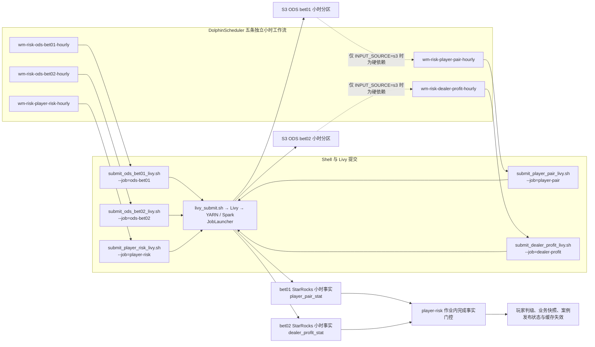
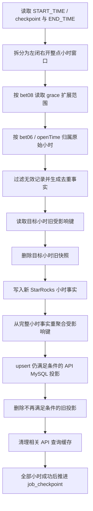
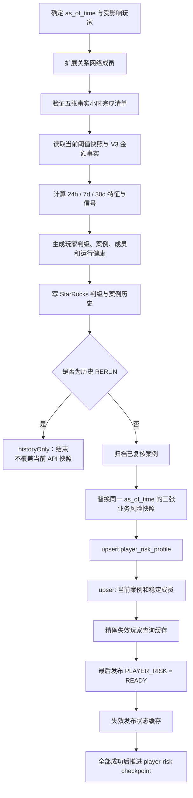

# 调度、部署和补数

> 项目状态：第一版候选实现，尚未正式上线。系统级模型与判级以
> [RISK_SYSTEM_DESIGN.md](RISK_SYSTEM_DESIGN.md) 为唯一依据；本文只说明本领域的执行细节。
> 本文只说明首次部署、调度、回填和发布顺序。

## 1. 构建和部署包

运行环境：JDK 11、Maven 3.9.x、Scala 2.12、Spark 3.5.x。

```powershell
.\build.bat --check-toolchain
.\build.bat
```

第一条命令只验证 JDK 11 和 Maven 3.9，不编译或打包。`build.bat` 默认使用
`-DskipTests` 跳过测试，构建应用、复制运行依赖，并从 `pom.xml` 读取版本号生成部署
目录和使用 POSIX `/` 入口的 ZIP。需要验证测试时单独运行 `mvn test`。本机敏感文件
不入库也不入部署包；若凭据曾进入历史，必须执行凭据轮换，删除当前文件或改写历史均
不能替代轮换。

输出目录：

```text
target/package/wm-trueman-risk-deploy-<project.version>/
target/package/wm-trueman-risk-deploy-<project.version>.zip
```

部署包包含应用 jar、依赖 jar、DDL、DolphinScheduler/Livy 脚本、配置模板和中英文文档。生产目录建议为：

```text
/opt/wm-risk
  app/
  bin/
  conf/
  docs/
  scripts/
  sql/
```

将 `conf/env.example` 复制为 `conf/env` 并填写真实值。模板保持单文件形式，内部按
11 个编号区块组织；运维人员应在对应区块修改值，不得修改变量名或改成多文件加载。
真实 `conf/env` 不进入 Git 或部署包；密码、证书私钥和真实 worker 清单不得提交到仓库。

## 2. 初始化数据库

先创建 StarRocks 数据库，再按顺序执行：

```bash
mysql -h <starrocks-fe> -P 9030 -u <user> -p < /opt/wm-risk/sql/starrocks.sql
mysql -h <starrocks-fe> -P 9030 -u <user> -p < /opt/wm-risk/sql/starrocks_hourly.sql
mysql -h <starrocks-fe> -P 9030 -u <user> -p < /opt/wm-risk/sql/starrocks_risk.sql
mysql -h <starrocks-fe> -P 9030 -u <user> -p < /opt/wm-risk/sql/starrocks_views.sql
mysql -h <api-mysql> -P 3306 -u <user> -p < /opt/wm-risk/sql/mysql_api.sql
```

- `starrocks.sql`：checkpoint、刷新键和 StarRocks 离线投影。
- `starrocks_hourly.sql`：9 张小时事实和完成清单。当前五张完成事实精确为 `baccarat_player_round_option_hourly`、`baccarat_player_round_hourly`、`baccarat_pair_round_hourly`、`baccarat_automation_group_round_hourly`、`baccarat_player_round_settlement_hourly`。
- `starrocks_risk.sql`：7 张玩家评估、赔付规则、阈值、案件和健康历史表。
- `starrocks_views.sql`：`v_baccarat_player_subround_order_hourly` 和 `v_baccarat_settlement_reconciliation_hourly` 两个逻辑聚合视图。视图不是完成事实，也不单独写入。
- `mysql_api.sql`：十张 API 查询投影的唯一结构真相源，包括玩家对、荷官收益、玩家风险、三张业务快照、三张案件投影及其查询索引；API Flyway 不创建或修改这些表。

第一版风险模型的精简库存为 17 张物理模型/控制表：9 张小时事实、7 张风险生命周期表和 `player_risk_refresh_key`；另有 2 个逻辑视图。`job_checkpoint`、通用刷新键和两张 StarRocks 离线投影继续保留，但不属于这 17 张风险模型表。已被精确事实替代的行为汇总表不再初始化或写入。

执行后检查：

```sql
SHOW TABLES;
SHOW CREATE TABLE player_pair_stat_hourly;
SHOW CREATE TABLE player_round_stat_hourly;
SHOW CREATE TABLE dealer_profit_stat_hourly;
SHOW CREATE TABLE baccarat_player_round_option_hourly;
SHOW CREATE TABLE baccarat_player_round_hourly;
SHOW CREATE TABLE baccarat_pair_round_hourly;
SHOW CREATE TABLE baccarat_automation_group_round_hourly;
SHOW CREATE TABLE baccarat_player_round_settlement_hourly;
SHOW CREATE TABLE baccarat_fact_hour_completion;
SHOW CREATE TABLE baccarat_risk_threshold_snapshot_daily;
SHOW CREATE TABLE baccarat_risk_case_hourly;
SHOW CREATE TABLE baccarat_risk_run_health_hourly;
SHOW CREATE VIEW v_baccarat_player_subround_order_hourly;
SHOW CREATE VIEW v_baccarat_settlement_reconciliation_hourly;
SHOW CREATE TABLE job_checkpoint;
```

切换到 API MySQL 后再检查：

```sql
SHOW CREATE TABLE player_risk_profile;
SHOW CREATE TABLE player_risk_publish_state;
SHOW CREATE TABLE baccarat_risk_case;
SHOW CREATE TABLE baccarat_risk_case_member;
SHOW CREATE TABLE baccarat_risk_case_review_history;
```

## 3. 上传运行文件

Livy JSON 中的 `file`、`jars` 和 `files` 必须指向可由 EMR 访问的 S3 对象。可使用部署脚本上传应用、依赖和证书：

```bash
source /opt/wm-risk/conf/env
bash /opt/wm-risk/bin/upload-s3-files.sh
```

仓库的五个 Livy JSON payload 均使用由 `APP_VERSION` 和 `APP_S3` 自动派生的 `RISK_APP_JAR_S3`、`RISK_DEPENDENCY_BASE_S3`，并要求配置 `SPARK_EVENT_LOG_S3`。正常小时任务中仅 `player-pair`、`dealer-profit` 和 `player-risk` 三个访问 StarRocks 的 payload 需要 `SR_TRUSTSTORE_S3`；MariaDB 来源的 `ods-bet01` 和 `ods-bet02` 不需要。一次性 StarRocks→S3 历史迁移例外：迁移脚本会通过内部 `ODS_TRUSTSTORE_S3` 为这两个 ODS payload 临时注入同一证书。

上传后确认：

- 五个 payload 的主 jar 和依赖 jar 均可读取。
- 正常小时任务的三个 StarRocks payload，以及一次性迁移触发的两个 ODS payload，都通过 `#sr-fe.jks` 将 truststore 放入 YARN 容器。
- 五个 `scripts/livy/*.json` payload 的共同 S3 路径与实际上传位置一致；所有实际访问 StarRocks 的提交还要核对 truststore 路径。
- Spark event log 目录存在且 EMR 运行角色有写权限。

## 4. 生产环境变量

完整模板位于 `deploy/conf/env.example`。

### 4.0 DolphinScheduler 全量覆盖契约

`conf/env` 中全部 143 个公开配置都可由单个 DolphinScheduler Shell 任务覆盖。最终
优先级固定为：

```text
命令行参数 > DolphinScheduler 已导出的非空变量 > conf/env 默认值
```

未设置或空字符串都读取 `conf/env` 默认值；只有非空任务参数才覆盖默认值。这样
DolphinScheduler 参数留空时无需维护重复配置。空字符串不能用于清除非空默认值；确需
清空的可选项应在受保护的 `conf/env` 中把默认值设为空。每个任务只需 export 偏离全局
默认值的非空配置。不要在任务日志执行 `env`、`export -p` 或 `set`，不得输出密码、
认证 URL 或其他秘密。

下面的 `player-pair` 任务同时覆盖版本、三个完整 S3 路径、资源数量和刷新范围：

```bash
#!/usr/bin/env bash
set -euo pipefail

export APP_VERSION="2.0.0"
export APP_S3="s3://my-risk-bucket/apps/wm-risk/2.0.0"
export RISK_APP_JAR_S3="s3://my-risk-bucket/apps/wm-risk/2.0.0/wm-trueman-risk-2.0.0.jar"
export RISK_DEPENDENCY_BASE_S3="s3://my-risk-bucket/apps/wm-risk/2.0.0/lib"
export STATS_NUM_EXECUTORS="12"
export PLAYER_PAIR_REFRESH_SCOPE="direct"

exec bash /opt/wm-risk/scripts/ds/submit_player_pair_livy.sh
```

wrapper 即使再次 source `/opt/wm-risk/conf/env`，也会保留这些任务值。`APP_S3`、
JAR 和 dependencies 是相互独立的完整路径；若只覆盖 `APP_VERSION`，显式配置的路径
不会被猜测或静默重写。

### 4.1 Livy 和 YARN

| 变量 | 作用 |
|---|---|
| `LIVY_HOST`, `LIVY_PORT` | Livy 地址，默认端口 8998 |
| `LIVY_USER`, `LIVY_PASSWORD` | Livy Basic Auth |
| `LIVY_POLL_INTERVAL_SEC` | 状态轮询间隔 |
| `LIVY_MAX_WAIT_SEC` | 单批次最长等待时间 |
| `YARN_QUEUE` | 最终提交的 YARN 队列，生产通常为 `prod` |
| `STATS_*` | 两个统计任务的 driver、executor 和数量配置 |

DolphinScheduler 任务优先级只决定 DS 内部调度顺序，最终 YARN 队列由 Livy 请求中的 `queue` 决定，也就是 `YARN_QUEUE`。

### 4.2 运行窗口

| 变量 | 作用 |
|---|---|
| `START_TIME` | 左闭窗口起点，格式 `yyyy-MM-dd HH:mm:ss` |
| `END_TIME` | 右开窗口终点 |
| `RERUN` | 是否为显式重算 |
| `INPUT_SOURCE` | 统计输入，`mysql` 或 `s3` |
| `HISTORY_BASE` | S3 ODS 根路径 |
| `JOB_WINDOW_GRACE_MINUTES` | 统计读取窗口前后扩展分钟数，默认 3 |
| `SPARK_SQL_SESSION_TIMEZONE` | Spark SQL 时区，建议 `Asia/Shanghai` |

所有 ODS、`player-pair`、`dealer-profit` 和 `player-risk` 写入窗口的起止时间都必须对齐整点，格式为 `yyyy-MM-dd HH:00:00`；不自动取整。非整点 checkpoint 会在任何源读取、小时删除或写入前失败；核对源数据与最后完整小时后，才可显式修正 checkpoint 或用 `RERUN=true` 重建，不能猜测边界。`bet08` grace 只扩大全量统计读取范围；`bet06/openTime` 仍将记录归属到原始左闭右开小时，ODS 写入不使用 grace。

### 4.3 数据连接

- `SOURCE_*`：源 MariaDB，读取 `bet01`、`bet02`；汇率直接取各表记录的 `bet11`。
- `ODS_JDBC_*`：ODS JDBC 分区和超时参数。
- `SR_*`：StarRocks JDBC、FE HTTP、写入重试和并发参数。
- `API_MYSQL_*`：API MySQL 地址、账号、批次和写并发。

风控报告使用 `mysql` CLI 连接 StarRocks。`SR_MYSQL_SSL_MODE` 建议设为 `VERIFY_CA` 或 `VERIFY_IDENTITY`，`SR_MYSQL_SSL_CA` 指向 CLI 可读取的 PEM CA 文件。JDBC URL 使用的 JKS truststore 不能直接传给 `mysql` CLI；客户端不支持 `--ssl-mode` 时，报告脚本会拒绝把证书校验降级为普通 TLS。

如出现 `SSL_CTX_set_default_verify_paths failed`，先在实际任务节点上检查：

```bash
source /opt/wm-risk/conf/env
printf 'mode=%s ca=%s\n' "$SR_MYSQL_SSL_MODE" "$SR_MYSQL_SSL_CA"
test -f "$SR_MYSQL_SSL_CA" && sudo -u ubuntu test -r "$SR_MYSQL_SSL_CA"
openssl x509 -in "$SR_MYSQL_SSL_CA" -noout -subject -issuer -dates
```

如果只有 Spark JDBC 使用的 JKS truststore，先导出 PEM CA；`keytool` 会交互询问 truststore 密码，不要把密码写入命令行或调度日志：

```bash
keytool -exportcert -rfc \
  -alias "${SR_TRUSTSTORE_ALIAS:-starrocks-fe}" \
  -keystore /path/to/sr-fe.jks \
  -file /tmp/starrocks-ca.pem

source /opt/wm-risk/conf/env
sudo install -o ubuntu -g ubuntu -m 0640 \
  /tmp/starrocks-ca.pem "$SR_MYSQL_SSL_CA"
```

确认 `conf/env` 中的 `SR_MYSQL_SSL_CA` 与实际安装路径一致后再重跑报告。

`API_MYSQL_WRITE_PARALLELISM` 建议从 4 开始；MySQL 压力较高时降到 2，只有确认写入阶段是瓶颈且数据库空闲时才提高到 6 或 8。

### 4.4 风控投影阈值

玩家同桌：

- `PLAYER_PAIR_API_MIN_SAME_ROUND_COUNT=3`
- `PLAYER_PAIR_API_MIN_PLAYER_ROUNDS=5`
- `PLAYER_PAIR_API_MIN_SAME_RATE=0.3`
- `PLAYER_PAIR_API_KEEP_SAME_ROUND_COUNT=10`

荷官盈利：

- `DEALER_PROFIT_API_MIN_BET_COUNT=20`
- `DEALER_PROFIT_API_MIN_VALID_BET=1000`
- `DEALER_PROFIT_API_MIN_PROFIT=0`
- `DEALER_PROFIT_API_MIN_PLAYER_ROI=0.2`
- `DEALER_PROFIT_API_KEEP_PROFIT=10000`

金额阈值均为人民币。

## 5. DolphinScheduler 小时任务

建议创建五个独立工作流。MySQL 输入模式不在这五个工作流之间建立 DolphinScheduler 依赖边：



| 工作流 | 调用脚本 | 条件/作业内门控 |
|---|---|---|
| `wm-risk-ods-bet01-hourly` | `scripts/ds/submit_ods_bet01_livy.sh` | 无 |
| `wm-risk-ods-bet02-hourly` | `scripts/ds/submit_ods_bet02_livy.sh` | 无 |
| `wm-risk-player-pair-hourly` | `scripts/ds/submit_player_pair_livy.sh` | MySQL 模式无 ODS 依赖；只有 S3 模式硬依赖 grace 重叠的 ODS `bet01` 小时 |
| `wm-risk-dealer-profit-hourly` | `scripts/ds/submit_dealer_profit_livy.sh` | MySQL 模式无 ODS 依赖；只有 S3 模式硬依赖 grace 重叠的 ODS `bet02` 小时 |
| `wm-risk-player-risk-hourly` | `scripts/ds/submit_player_risk_livy.sh` | 无调度器依赖边；作业内 fail-closed 校验完成事实、阈值和上游 checkpoint |

玩家判级工作流使用显式 `START_TIME`、`END_TIME`，设置
`RERUN=false`、`PLAYER_RISK_REFRESH_SCOPE=all`。无需在 DolphinScheduler 中串联工作流；作业在每个小时开始前自行检查当前五张完成事实，以及 `player-pair`、`dealer-profit` 成功 checkpoint 不早于该小时右边界。任一条件未就绪时 fail closed，不发布、不推进 `player-risk` checkpoint。

```sql
SELECT job_name, last_update_time, status
FROM job_checkpoint
WHERE job_name IN ('player-pair', 'dealer-profit', 'player-risk')
ORDER BY job_name;
```

为 Shell 节点定义两个 `IN/VARCHAR` 本地参数，例如：

```text
start_time = $[yyyy-MM-dd HH:00:00-1]
end_time   = $[yyyy-MM-dd HH:00:00]
```

Shell 内容只使用 DolphinScheduler 能够精确替换的 `${参数名}` 形式：

```bash
source /opt/wm-risk/conf/env

START_TIME="${start_time}"
END_TIME="${end_time}"
set -euo pipefail

[[ -n "$START_TIME" ]] || { echo "start_time is required" >&2; exit 2; }
[[ -n "$END_TIME" ]] || { echo "end_time is required" >&2; exit 2; }

export START_TIME END_TIME
export RERUN=false
export INPUT_SOURCE=mysql
export YARN_QUEUE=prod

bash /opt/wm-risk/scripts/ds/submit_player_pair_livy.sh
```

DS 应生成明确的小时起止时间，不要依赖节点本地当前时间。跨日窗口同样使用完整时间字符串，例如 `23:00:00` 到次日 `00:00:00`。不要在 Shell 中使用 `${refresh_end_time:?message}` 这类 Bash 扩展形式引用 DS 参数；DS 只替换完整的 `${refresh_end_time}`，扩展形式会保留到 Bash 并触发未定义变量错误。

### 5.1 正常增量模式

```text
RERUN=false
INPUT_SOURCE=mysql
START_TIME=<可选>
END_TIME=<必填>
```

- 显式提供 `START_TIME`：任务使用该起点，全部小时成功后将 checkpoint 推进到 `END_TIME`。
- 不提供 `START_TIME`：任务从对应 `job_checkpoint.last_update_time` 开始。
- checkpoint 不存在且未提供 `START_TIME`：任务失败，不会猜测起点。

### 5.2 玩家对刷新范围

`PLAYER_PAIR_REFRESH_SCOPE=direct` 只重算本窗口直接变化的玩家对，适合小时任务。

`PLAYER_PAIR_REFRESH_SCOPE=player` 会把受影响玩家参与的所有历史玩家对纳入重算，用于严格传播玩家回合分母变化，但扫描范围更大。可将 `direct` 用于小时任务，并定期执行一次完整离线投影刷新进行校准。

### 5.3 小时统计节点内部流程

`player-pair` 和 `dealer-profit` 的每个小时窗口都执行同一套幂等替换骨架：



`RERUN=true` 必须显式给出时间窗，不读取或推进实时 checkpoint。所有目标小时都采用完整替换，不允许累计 `+=` 写入。

## 6. 历史数据补数

统一脚本：

```bash
source /opt/wm-risk/conf/env
bash /opt/wm-risk/scripts/ds/backfill_history_livy.sh \
  --start "2026-05-01 00:00:00" \
  --end "2026-06-01 00:00:00" \
  --window-hours 24
```

执行顺序：

1. `ods-bet01`
2. `ods-bet02`
3. `player-pair`，使用 `RERUN=true` 和 `INPUT_SOURCE=s3`
4. `dealer-profit`，使用 `RERUN=true` 和 `INPUT_SOURCE=s3`
5. 校验 StarRocks 小时事实。
6. 根据计划推进 checkpoint。
7. 重建投影并清理 API 查询缓存。

脚本默认可并行运行两个 ODS 任务和两个统计任务，并使用 `_backfill_state` done marker 跳过成功窗口。done marker 只属于补数脚本，Spark 任务不会读取它。

需要强制重算已经存在 done marker 的窗口时，设置 `BACKFILL_SKIP_DONE=false`。这会忽略 marker 并重新执行，不需要删除 S3 上的 `_backfill_state`。只有明确停用整套补数状态且确认没有并发补数任务时，才考虑清理状态目录。

### 6.1 grace 覆盖

统计窗口向前后扩展 `JOB_WINDOW_GRACE_MINUTES`，但 ODS 只写精确窗口。补数脚本默认通过 `BACKFILL_ODS_COVER_STATS_GRACE=true` 扩展 ODS 准备范围，确保边界小时可被统计读取。

### 6.2 checkpoint

`RERUN=true` 不读取或更新 `job_checkpoint`。全部补数成功并完成质量校验后，可以执行脚本输出的 checkpoint SQL，或手工更新：

```sql
INSERT INTO job_checkpoint
  (job_name, last_update_time, status, finish_time, created_time, update_time)
VALUES
  ('player-pair', '2026-06-01 00:00:00', 'SUCCESS', CURRENT_TIMESTAMP, CURRENT_TIMESTAMP, CURRENT_TIMESTAMP),
  ('dealer-profit', '2026-06-01 00:00:00', 'SUCCESS', CURRENT_TIMESTAMP, CURRENT_TIMESTAMP, CURRENT_TIMESTAMP);
```

`last_update_time` 必须是已确认完整成功的 `bet08` 窗口右边界，不能使用任务完成时间、最大 `bet06` 或当前时间代替。

### 6.3 玩家风险历史回放

当前回放只读取以下五张完成事实：`baccarat_player_round_option_hourly`、`baccarat_player_round_hourly`、`baccarat_pair_round_hourly`、`baccarat_automation_group_round_hourly`、`baccarat_player_round_settlement_hourly`。设回放窗口为 `[replay_start, replay_end)`，五个来源都必须在 `[replay_start - 30 个自然日, replay_end)` 的每个整点有一条成功完成记录，包括合法零数据小时。`player_pair_stat_hourly`、`player_round_stat_hourly`、`dealer_profit_stat_hourly` 不能作为当前 wrapper 的完成条件。

`--baseline-date` 是必需参数，并且必须满足 `baseline_date <= replay_start_date - 30 个自然日`。然后执行：

```bash
source /opt/wm-risk/conf/env
export PLAYER_RISK_HISTORY_READY=true
REPLAY_START="2026-06-01 00:00:00"
REPLAY_END="2026-07-01 00:00:00"
BASELINE_DATE="2026-05-01"
bash /opt/wm-risk/scripts/ds/backfill_player_risk_livy.sh \
  --start "$REPLAY_START" \
  --end "$REPLAY_END" \
  --baseline-date "$BASELINE_DATE" \
  --window-hours 24
```

脚本先验证五张事实的精确完成清单和完整不可变阈值快照，再固定使用 `RERUN=true`、`PLAYER_RISK_SHADOW_ONLY=true` 和默认 `PLAYER_RISK_REFRESH_SCOPE=all`。它不会发布 API 当前画像，也不会更新线上 `player-risk` checkpoint。回放完成后使用 `generate_player_risk_calibration_report.sh --start ... --end ... --model-version BACCARAT_ANTI_ARBITRAGE_V1` 生成验收报告；缺少任一评估小时会直接失败。

判级作业通过 API 的签名内部端点精确清理 `risk-player-assessment` 和
`risk-player-publish-state` 缓存。对应 API 客户端只授予 `risk:cache:evict` 权限；
`RISK_API_KEY`、`RISK_API_SECRET` 只注入 Livy driver，不下发 executor。

安全上线顺序固定为：先执行 StarRocks 与 API MySQL DDL；再发布能识别新表和缓存名的 API，并确认首次全局发布前返回 `UNKNOWN / STALE`；随后以 shadow 模式部署 `player-risk`、完成至少 30 天回放和首个最新快照发布。`BACCARAT_ANTI_ARBITRAGE_V1` 必须影子运行四周并达到人工复核与明确正常比例验收门槛；首版不启用自动执行动作。历史回放只生成校准数据和报告，不自动改阈值，也不推进线上 checkpoint。

### 6.4 玩家对相反下注局数全历史回填

`opposite_round_count` 是第一版初始化序列的一部分：使用现存
`player_pair_stat_hourly` 的最早保留小时作为 `BACKFILL_START`，初始化截止整点作为
`BACKFILL_END`，对全部保留历史执行回填。首版不存在需要保留的旧线上 API 合同；在完整
初始化、验收和缓存清理前，不向调用方暴露 `oppositeRoundCount`。

可执行发布顺序：

1. 暂停玩家对投影的正常小时发布，且不向调用方暴露当前投影。
2. 在任何回填前按首版初始化顺序执行五个 canonical DDL 文件；API 在完整验收前必须保持停止或无流量。
3. 先以 `--facts-only` 检查 `baccarat_pair_round_hourly` 完成清单；缺失小时先准备覆盖 grace 的 ODS `bet01` 分区。
4. 部署首版离线 writer，使用现有可恢复 wrapper 对全部保留历史分段执行 `RERUN=true`；该操作不推进实时 checkpoint。
5. 从完整小时事实重建 StarRocks `player_pair_stat`，并重建 API MySQL 投影；`player-pair` 回填完成后 API MySQL 已按受影响键重聚合为完整累计投影。
6. 先使用 `--skip-api` 验收 StarRocks，再完成完整 facts-only/跨库验收。
7. 完整验收通过后，在无流量状态部署或启动包含 `oppositeRoundCount` 的 API；确认本机健康检查和签名冒烟查询全部通过。
8. API 部署验证通过后清理四个相关玩家对缓存。
9. 最后向负载均衡暴露新 API 合同，并恢复正常小时发布。

```bash
source /opt/wm-risk/conf/env

BACKFILL_START="2024-01-01 00:00:00"  # 查询得到的最早保留小时
BACKFILL_END="2026-07-25 00:00:00"    # 发布截止整点

# 必须在回填前按顺序完成首版 canonical 初始化。
mysql -h <starrocks-fe> -P 9030 -u <user> -p < /opt/wm-risk/sql/starrocks.sql
mysql -h <starrocks-fe> -P 9030 -u <user> -p < /opt/wm-risk/sql/starrocks_hourly.sql
mysql -h <starrocks-fe> -P 9030 -u <user> -p < /opt/wm-risk/sql/starrocks_risk.sql
mysql -h <starrocks-fe> -P 9030 -u <user> -p < /opt/wm-risk/sql/starrocks_views.sql
mysql -h <api-mysql> -P 3306 -u <user> -p < /opt/wm-risk/sql/mysql_api.sql

bash /opt/wm-risk/scripts/ds/verify_player_pair_opposite_round_count.sh \
  --start "$BACKFILL_START" --end "$BACKFILL_END" --facts-only

bash /opt/wm-risk/scripts/ds/backfill_player_pair_livy.sh \
  --start "$BACKFILL_START" --end "$BACKFILL_END" \
  --window-hours 24 --force-rerun

bash /opt/wm-risk/scripts/ds/refresh_starrocks_projection_daily.sh \
  --end "$BACKFILL_END" --player-pair --skip-ddl

bash /opt/wm-risk/scripts/ds/verify_player_pair_opposite_round_count.sh \
  --start "$BACKFILL_START" --end "$BACKFILL_END" --skip-api

# API MySQL 已由 canonical DDL 初始化；现在完成跨库验收。
bash /opt/wm-risk/scripts/ds/verify_player_pair_opposite_round_count.sh \
  --start "$BACKFILL_START" --end "$BACKFILL_END"

# API 仍不接收负载均衡流量。此时部署/启动，再完成本机健康检查和签名冒烟。
bash /opt/wm-risk-api/scripts/deploy.sh
curl -fsS http://127.0.0.1:8080/actuator/health
bash /opt/wm-risk-api/scripts/test_api.sh

# 只在无流量 API 验证通过后清理四个玩家对缓存。
bash /opt/wm-risk/scripts/ds/evict_player_pair_cache.sh

# 此后才把 API 加回流量，并恢复 wm-risk-player-pair-hourly。
```

验收脚本验证：完成小时数、精确局事实按玩家对和 `round_key` 去重后的小时值、
小时/累计 `0 <= opposite_round_count <= same_round_count`、StarRocks 每日投影与完整
小时事实一致，以及 StarRocks/API MySQL 的行数和两项累计和一致。失败时保留已完成的
分段和 `_backfill_state` marker，修复后从失败分段继续；不得删除 marker 或推进线上
checkpoint。

## 7. StarRocks 每日离线投影

从完整小时事实重建 StarRocks 同形投影：

```bash
source /opt/wm-risk/conf/env
bash /opt/wm-risk/scripts/ds/refresh_starrocks_projection_daily.sh \
  --end "2026-07-18 00:00:00"
```

DolphinScheduler 每日任务可定义本地参数：

```text
refresh_end_time = $[yyyy-MM-dd] 00:00:00
```

Shell 内容：

```bash
source /opt/wm-risk/conf/env

REFRESH_END_TIME="${refresh_end_time}"
set -euo pipefail
[[ -n "$REFRESH_END_TIME" ]] || {
  echo "refresh_end_time is required" >&2
  exit 2
}

echo "Refresh snapshot end time: $REFRESH_END_TIME"
bash /opt/wm-risk/scripts/ds/refresh_starrocks_projection_daily.sh \
  --end "$REFRESH_END_TIME"
```

常用参数：

```bash
# 仅预览 SQL
bash /opt/wm-risk/scripts/ds/refresh_starrocks_projection_daily.sh --dry-run

# DDL 已初始化时跳过建表
bash /opt/wm-risk/scripts/ds/refresh_starrocks_projection_daily.sh --skip-ddl

# 只刷新一类投影
bash /opt/wm-risk/scripts/ds/refresh_starrocks_projection_daily.sh --player-pair
bash /opt/wm-risk/scripts/ds/refresh_starrocks_projection_daily.sh --dealer-profit
```

脚本对目标投影执行 `TRUNCATE + INSERT`，因此不要与依赖这些 StarRocks 投影的长查询并发运行。小时事实不受影响。

## 8. API 查询缓存清理

创建两个独立的 DolphinScheduler Shell 任务：

| 任务名称 | Shell 命令 | 建议上游 |
|---|---|---|
| `wm-risk-evict-player-pair-cache` | `bash /opt/wm-risk/scripts/ds/evict_player_pair_cache.sh` | `wm-risk-player-pair-hourly` 或玩家同桌补数任务 |
| `wm-risk-evict-dealer-profit-cache` | `bash /opt/wm-risk/scripts/ds/evict_dealer_profit_cache.sh` | `wm-risk-dealer-profit-hourly` 或荷官盈利补数任务 |

两个任务清理的是 API Redis/Valkey 查询结果缓存，不是 StarRocks 内部缓存。玩家同桌任务清理 `risk-player-pairs`、`risk-player-pair-evaluate`、`risk-player-pair-top`；荷官盈利任务清理 `risk-dealer-players`、`risk-player-dealer-profits`、`risk-dealer-profit-anomalies`。`risk-player-profile` 同时依赖两类投影，所以两个任务都会清理它。

在 `/opt/wm-risk/conf/env` 配置 `REDIS_HOST`、`REDIS_PORT`、`REDIS_PASSWORD` 和 `REDIS_TLS`。DolphinScheduler Worker 必须安装 `redis-cli`，并可通过安全组访问 Redis/Valkey。脚本只扫描并删除上述 Spring Cache 前缀，不清理 API 客户端、nonce 或限流 key。

API 查询结果默认十分钟过期。如果不要求投影更新后立即可见，可以不配置这两个任务，等待 TTL 自动失效。

## 9. 风控分析报告

报告分为每日巡检和专项调查，核心指标都从 StarRocks 小时事实按目标窗口重新聚合。API MySQL 累计候选投影不能用于计算真实当日利润、投注和同桌次数。

### 9.1 每日巡检

DolphinScheduler Shell 节点定义三个 `IN/VARCHAR` 本地参数：

```text
report_start_time = $[yyyy-MM-dd-1] 00:00:00
report_end_time   = $[yyyy-MM-dd] 00:00:00
report_date       = $[yyyy-MM-dd-1]
```

Shell 内容：

```bash
source /opt/wm-risk/conf/env

REPORT_START_TIME="${report_start_time}"
REPORT_END_TIME="${report_end_time}"
REPORT_DATE="${report_date}"
set -euo pipefail

install -d -m 750 /opt/wm-risk/reports
bash /opt/wm-risk/scripts/ds/generate_daily_risk_report.sh \
  --start "$REPORT_START_TIME" \
  --end "$REPORT_END_TIME" \
  --limit 20 \
  --output "/opt/wm-risk/reports/daily-${REPORT_DATE}.md"
chmod 640 "/opt/wm-risk/reports/daily-${REPORT_DATE}.md"
```

脚本默认统计昨日完整自然日，并对比前一个等长窗口。报告包含 checkpoint、小时事实覆盖、核心 KPI、异常类型、集中度、荷官/玩家/游戏排行、窗口同桌率，以及 P1/P2/P3 调查队列。需要附加 API MySQL 累计投影规模、更新时间和窗口候选键覆盖核对时增加 `--check-api-projection`；窗口与累计投影的聚合范围不同，缺失键只能作为专项核对线索。

### 9.2 专项调查

专项调查通常由人工触发，时间必须对齐整点。建议分别创建玩家、荷官、玩家对三个手工工作流，避免在同一任务中混用目标参数。

玩家调查定义以下 `IN/VARCHAR` 本地参数：

```text
investigation_player_id = 1001
investigation_start_time = $[yyyy-MM-dd-30] 00:00:00
investigation_end_time = $[yyyy-MM-dd] 00:00:00
```

Shell 内容：

```bash
source /opt/wm-risk/conf/env
PLAYER_ID="${investigation_player_id}"
START_TIME="${investigation_start_time}"
END_TIME="${investigation_end_time}"
set -euo pipefail

install -d -m 750 /opt/wm-risk/reports
bash /opt/wm-risk/scripts/ds/generate_risk_investigation_report.sh \
  --player-id "$PLAYER_ID" \
  --start "$START_TIME" \
  --end "$END_TIME" \
  --output "/opt/wm-risk/reports/player-${PLAYER_ID}.md"
chmod 640 "/opt/wm-risk/reports/player-${PLAYER_ID}.md"
```

荷官调查定义 `investigation_dealer_id`、`investigation_start_time`、`investigation_end_time`，Shell 内容：

```bash
source /opt/wm-risk/conf/env
DEALER_ID="${investigation_dealer_id}"
START_TIME="${investigation_start_time}"
END_TIME="${investigation_end_time}"
set -euo pipefail

install -d -m 750 /opt/wm-risk/reports
bash /opt/wm-risk/scripts/ds/generate_risk_investigation_report.sh \
  --dealer-id "$DEALER_ID" \
  --start "$START_TIME" \
  --end "$END_TIME" \
  --output "/opt/wm-risk/reports/dealer-${DEALER_ID}.md"
chmod 640 "/opt/wm-risk/reports/dealer-${DEALER_ID}.md"
```

玩家对调查定义 `investigation_player_a`、`investigation_player_b`、`investigation_start_time`、`investigation_end_time`，Shell 内容：

```bash
source /opt/wm-risk/conf/env
PLAYER_A="${investigation_player_a}"
PLAYER_B="${investigation_player_b}"
START_TIME="${investigation_start_time}"
END_TIME="${investigation_end_time}"
set -euo pipefail

install -d -m 750 /opt/wm-risk/reports
bash /opt/wm-risk/scripts/ds/generate_risk_investigation_report.sh \
  --player-a "$PLAYER_A" \
  --player-b "$PLAYER_B" \
  --start "$START_TIME" \
  --end "$END_TIME" \
  --output "/opt/wm-risk/reports/pair-${PLAYER_A}-${PLAYER_B}.md"
chmod 640 "/opt/wm-risk/reports/pair-${PLAYER_A}-${PLAYER_B}.md"
```

一次执行只能选择玩家、荷官或玩家对中的一种。未显式提供时间时默认调查最近 30 个完整自然日。玩家对报告会把直接共同回合与共享荷官/游戏的间接暴露分开说明。

统一入口也可使用 `generate_risk_report.sh --type daily|investigation`，但 DolphinScheduler 建议直接调用对应业务脚本，使任务职责和参数更清晰。

## 10. Livy 管理

```bash
source /opt/wm-risk/conf/env

bash /opt/wm-risk/scripts/livy/livy_admin.sh list 0 50
bash /opt/wm-risk/scripts/livy/livy_admin.sh get <batch_id>
bash /opt/wm-risk/scripts/livy/livy_admin.sh state <batch_id>
bash /opt/wm-risk/scripts/livy/livy_admin.sh log <batch_id> 0 200
bash /opt/wm-risk/scripts/livy/livy_admin.sh delete <batch_id>
```

Livy 返回 `success` 只是任务成功的第一层判断，还应验证 YARN 最终状态、StarRocks 小时数据、checkpoint 和 API MySQL 投影。

## 11. BACCARAT_ANTI_ARBITRAGE_V1 影子调度

### 11.1 唯一合同和判级边界

生产配置只允许：

```text
PLAYER_RISK_MODEL_VERSION=BACCARAT_ANTI_ARBITRAGE_V1
PLAYER_RISK_METRIC_CONTRACT=BET17_POCKET_NET_V3
PLAYER_RISK_BASELINE_CONTRACT=BACCARAT_AA_V1_NON_OVERLAP_90D_BET17_POCKET_NET_V3
PLAYER_RISK_SHADOW_ONLY=true
```

五个正式信号家族是 `HEDGE_ARBITRAGE`、`REBATE_WASH`、`COORDINATED_AUTOMATION`、`RELATIVE_TIMING_OUTCOME_ANOMALY` 和 `MULTI_ACCOUNT_LINK`。只有 `HEDGE_ARBITRAGE` 和 `REBATE_WASH` 两条核心路径可以产生 `HIGH`；辅助信号单独最高为 `MEDIUM`。关键事实不完整、合同不匹配、金额对账失败、基线不安全或赔率规则缺失时输出 `UNKNOWN`，不得降为 `LOW`。

### 11.2 小时、每日和健康报告顺序

以下是规范工作流清单，不是依赖顺序：

1. `wm-risk-ods-bet01-hourly`
2. `wm-risk-ods-bet02-hourly`
3. `wm-risk-player-pair-hourly`
4. `wm-risk-dealer-profit-hourly`
5. `wm-risk-player-risk-hourly`

MySQL 输入模式下五个小时工作流在 DolphinScheduler 中相互独立。作为五个独立小时工作流，它们无需串联；不要为了清单顺序把 ODS 和统计任务串行化。只有 S3 输入模式的统计任务对其 grace 读取重叠的 ODS 整点小时有硬依赖。`player-risk` 作业内仍会先校验 `player-pair`、`dealer-profit` 成功 checkpoint 与五张精确完成事实；阈值快照缺失或不安全时，对应证据和玩家判级 fail closed 为 `UNKNOWN`。这些都不是额外的调度器依赖边。每日校准和健康报告只对其覆盖窗口的完成事实建立条件依赖。

`player-risk` 的当前投影按以下顺序原子发布：



`READY` 必须最后写入。任一步失败都不得让 API 暴露一半新、一半旧的快照；历史回放不得覆盖更新的在线 `as_of_time`。

五张精确完成事实是：

1. `baccarat_player_round_option_hourly`
2. `baccarat_player_round_hourly`
3. `baccarat_pair_round_hourly`
4. `baccarat_automation_group_round_hourly`
5. `baccarat_player_round_settlement_hourly`

每日校准工作流 `wm-risk-baccarat-calibration-daily` 以每日闭合自然日为基准，必须先确定目标评分日，而不是把前一个闭合日直接当作快照日期。若任务在业务日 D 闭合后为 D+1 的评分准备阈值，DolphinScheduler 参数为：

```text
scoring_as_of_date = $[yyyy-MM-dd+1]
baseline_as_of_date = $[yyyy-MM-dd-29]
```

两者必须满足 `baseline_as_of_date <= scoring_as_of_date - 30 个自然日`；上面的日常公式取等号。前一个闭合日不能直接作为下一评分日的 `baseline_as_of_date`：以 D 生成的快照最早到 D+30 才可被评分选择。

使用默认 90 天 lookback 时，一次完整准备会扫描 `[baseline_as_of_date - 149 个自然日, baseline_as_of_date - 30 个自然日)`：五张事实在其中每个自然日各有 24 个成功小时，包括合法零数据小时。因为 `baseline_as_of_date = T - 30 个自然日`，目标评分日 T 对应的校准事实窗口为 `[T - 179 个自然日, T - 60 个自然日)`，共 119 个完整事实日期。默认完整准备目标是 90 个完整候选锚点，并包含每个锚点所需的前置 30 天特征范围；`complete_anchor_count >= 90` 时 `confidence = NORMAL`。默认最低发布门槛是 30 个 eligible anchors：30–89 个时 `confidence = LOW`；每个阈值 bundle 只有在 `complete_anchor_count >= 30 AND distinct_player_count >= 500` 时 `moderate_sample_safe = true`，在 `complete_anchor_count >= 30 AND distinct_player_count >= 1000` 时 `strong_sample_safe = true`。少于 30 个 eligible anchors 时校准脚本拒绝发布并归为 `INSUFFICIENT`。因此 119 天是自足的 90-anchor 完整置信准备目标，不是独立校准脚本的额外硬门槛。每日校准必须在目标评分日开始前完成：

```bash
source /opt/wm-risk/conf/env
SCORING_AS_OF_DATE="${scoring_as_of_date}"
BASELINE_AS_OF_DATE="${baseline_as_of_date}"
[[ "$(date -d "$SCORING_AS_OF_DATE - 30 days" '+%Y-%m-%d')" == "$BASELINE_AS_OF_DATE" ]] || {
  echo "baseline_as_of_date must equal scoring_as_of_date - 30 days" >&2
  exit 2
}
bash /opt/wm-risk/scripts/ds/calibrate_baccarat_risk_daily.sh \
  --as-of "$BASELINE_AS_OF_DATE" \
  --lookback-days 90 \
  --minimum-days 30
```

评分引擎实际会在 `baseline_date <= scoring_as_of_date - 30 个自然日` 且 `moderate_sample_safe = true` 的完整十指标评分候选中，先按同群体回退层级，再选择该层级最新的快照。`matched_amount` 只表示庄闲配对覆盖金额；单账号洗码、同账号自对冲、自动化以及正式经济证据统一使用独立的 `valid_bet_amount` 有效投注门槛，禁止交叉比较。`relative_delay` 是同一局、桌台、佣金和玩法内按最后下注时间计算的 `[0,1]` `PERCENT_RANK`，绝对中/强门槛默认为 0.90/0.95；`automation_sequence_similarity` 在运行时和校准中都由 `member_count` 与 `synchronization_span_millis` 使用同一公式复算。相同不可变快照还包含第十一个仅调查指标 `dealer_table_concentration`；它采用 P99/P99.5 与 0.80/0.90 绝对门槛，只能生成荷官/桌台集中度调查标签，不进入十指标评分。缺少任何正式指标的阈值快照不可用于评分。目标 `baseline_as_of_date` 缺失时，只要存在更旧的安全快照仍会继续评分，不会仅因日期较旧自动输出 `UNKNOWN`；只有不存在任何可选安全快照或命中其他 fail-closed 条件时才输出 `UNKNOWN`。目标日期精确命中属于外部/人工 shadow readiness preflight 和健康告警，不是评分引擎的硬门槛；刚闭合但尚不可选的快照仍不能用于下一评分日。

每日 `wm-risk-baccarat-health-report-daily` 针对 `[report_start_time, report_end_time)` 运行，仅在该窗口的五张完成事实和评估健康行齐全后执行。若同一任务链还验证目标评分日阈值，则它条件依赖上述校准完成；否则健康报告与校准没有无条件先后关系。需要在目标评分前完成联合检查时：

```bash
source /opt/wm-risk/conf/env
bash /opt/wm-risk/scripts/ds/generate_baccarat_risk_health_report.sh \
  --start "${report_start_time}" \
  --end "${report_end_time}" \
  --format json \
  --output-dir /opt/wm-risk/reports/baccarat-health
```

健康报告检查事实完整率、V3 覆盖、金额对账、`UNKNOWN` 原因、阈值回退/漂移、等级分布、案件变化、图分量、按 `TAG_CODE` 展示的调查标签分布、队列积压和源单追溯。关键完整率或追溯率低于 100% 时任务失败；调查标签及其他健康指标只用于审计和安全运行，不增加玩家风险分。

### 11.3 首版初始化与历史回填

第一版尚未上线，结构初始化只按以下顺序执行 canonical DDL：

```text
starrocks.sql
starrocks_hourly.sql
starrocks_risk.sql
starrocks_views.sql
mysql_api.sql
```

首版前迁移 SQL 和专用迁移编排不再执行。历史准备继续拆成独立任务：使用各个 `backfill_*` wrapper 回填事实，使用 `calibrate_baccarat_risk_daily.sh` 发布满足样本安全条件的不可变阈值快照，并使用 `generate_baccarat_risk_health_report.sh` 验证 V3、对账、完整性和风险运行健康。S3 输入时，先准备统计 grace 涉及的全部 bet08 整点 ODS 分区。历史任务只在成功后写入自身可续跑的 `_backfill_state` done marker；不得删除 marker，不得用历史回放覆盖更新的 API 快照或推进实时 checkpoint。

单独执行玩家风险历史影子回放时，wrapper 会验证五张精确完成事实在 `[replay_start - 30 个自然日, replay_end)` 的逐小时覆盖，并要求完整不可变阈值快照：

```bash
REPLAY_START="2026-06-01 00:00:00"
REPLAY_END="2026-07-01 00:00:00"
BASELINE_DATE="2026-05-01"
bash /opt/wm-risk/scripts/ds/backfill_player_risk_livy.sh \
  --start "$REPLAY_START" \
  --end "$REPLAY_END" \
  --baseline-date "$BASELINE_DATE" \
  --window-hours 24
```

### 11.4 案件队列、生命周期和调查

队列容量不改变案件判级。所有 `CRITICAL` 进入人工队列；每日仅优先处理 10–20 个新 `HIGH`，溢出的案件仍保持 `HIGH`。七天内相同团伙指纹合并更新并追加证据，不覆盖历史。

案件生命周期为 `OPEN`、`MONITORING`、`IN_REVIEW`、`CONFIRMED`、`DISMISSED_NORMAL`、`INSUFFICIENT_EVIDENCE`、`STALE`。案件同时保存当前等级和只增不减的历史峰值；普通 `MEDIUM` 七天无新证据可转为 `STALE`，`HIGH` 和 `CRITICAL` 必须由人工结案。

调查界面和导出至少包含：案件 ID/类型/状态，当前与峰值分数和等级，B/R/E/P 分项及原因码，成员/角色/对手/IP，命中局、桌台、荷官和时间线，匹配本金、覆盖率、残余敞口、有效投注、`game_pnl`、`rebate`、`total_net_earnings`、对账差异，模型/金额/基线合同、阈值快照，以及源注单、结算和小时事实引用。

### 11.5 影子验收与人工动作

影子运行必须连续四周并人工复核至少 200 个去重案件。标签固定为 `CONFIRMED_ARBITRAGE`、`ENHANCED_DUE_DILIGENCE`、`NORMAL_BEHAVIOR`、`INSUFFICIENT_EVIDENCE`。可行动比例 `(CONFIRMED_ARBITRAGE + ENHANCED_DUE_DILIGENCE) / 已复核` 不低于 70%，明确正常比例 `NORMAL_BEHAVIOR / 已复核` 不高于 20%，源注单和结算追溯率为 100%。

```bash
bash /opt/wm-risk/scripts/ds/generate_player_risk_calibration_report.sh \
  --start "2026-06-01 00:00:00" \
  --end "2026-07-01 00:00:00" \
  --model-version BACCARAT_ANTI_ARBITRAGE_V1
```

影子运行只计算、打标、建案、通知和生成建议，不触发任何自动处置。停优惠、限注、KYC、出款审核、冻结和封号均须人工批准；`BLOCK_RECOMMENDED` 仅是人工建议。现有数据看不到充值/提现、设备/KYC/支付关系和关盘时间，不能证明真实资金闭环、设备团伙或关盘后下注，也不能报告实际挽损或召回率。

### 11.6 首次上线失败恢复原则

首次上线失败恢复见 `TROUBLESHOOTING.md`。核心原则是停止 `player-risk` 发布并保持 `PLAYER_RISK_SHADOW_ONLY=true`，保留完整玩家风险事实、案件、评估历史、阈值快照和人工标签；只有经过明确批准的快照操作才可恢复之前的 API publish-state。不得删除、截断或重算覆盖源事实，也不得切换到未在当前配置、DDL 和发布状态中声明的判级合同。只有已安装制品存在时，二进制或配置部署才使用 rollback。

## ML Python 环境归档（手工操作）

`scripts/ml/build_ml_envs.sh` 是 manual build/deployment utility，not a sixth Spark production job；它不应加入现有五个生产 Spark 作业或 Livy production submission allowlist。只能在 EMR 7.13.0 primary node 的 Amazon Linux 2023 上运行，并且必须使用 `/usr/bin/python3.11`。

在主节点从部署目录执行。以下命令构建所有 bundle，第二条只构建单一 bundle；`--dry-run` 只校验参数并打印计划。已发布版本是不可变的：已存在 completion manifest 时拒绝覆盖，只有明确给出 `--force` 才能重新发布。

```bash
bash /opt/wm-risk/scripts/ml/build_ml_envs.sh --version 2026.07.22 --s3-prefix s3://<bucket>/<prefix>
bash /opt/wm-risk/scripts/ml/build_ml_envs.sh --version 2026.07.22 --s3-prefix s3://<bucket>/<prefix> --bundle graph
bash /opt/wm-risk/scripts/ml/build_ml_envs.sh --version 2026.07.22 --s3-prefix s3://<bucket>/<prefix> --dry-run
bash /opt/wm-risk/scripts/ml/build_ml_envs.sh --version 2026.07.22 --s3-prefix s3://<bucket>/<prefix> --force
```

`base` 提供数据处理包；`classical` 加入传统统计和 scikit-learn；`boosting` 提供梯度提升包，并使用 CPU-only XGBoost；`graph` 提供图分析包，包含 GPL-licensed igraph/leidenalg。每个 bundle 的 S3 key layout 为 `<prefix>/<bundle>/<version>/py311/<arch>/`，包含四个 artifacts：环境 `.tar.gz`、`requirements.lock`、`SHA256SUMS` 和 `manifest.json`。`manifest.json` 是 completion marker。

运行身份需要在目标前缀下具备 read/head 和 put 权限，并可访问 PyPI 或 private Python package index。构建环境必须让 driver 和 executors 使用 same EMR release、`/usr/bin/python3.11` 和 CPU architecture；archive is not portable across architectures。

PySpark 由 EMR 提供，且 deliberately absent 于这些 bundle。TensorFlow、PyTorch、Jupyter、MLflow 和 GPU XGBoost 都不在范围内。发布后先核对 manifest 与 SHA256SUMS，再提交一个小的 Livy executor import check；本地 Windows 测试不会验证 native EMR wheels。

```json
{
  "archives": ["s3://...tar.gz#mlenv"],
  "conf": {
    "spark.pyspark.python": "./mlenv/bin/python",
    "spark.yarn.appMasterEnv.PYSPARK_PYTHON": "./mlenv/bin/python",
    "spark.executorEnv.PYSPARK_PYTHON": "./mlenv/bin/python"
  }
}
```

### 不可变发布 IAM、校验与 executor 探针

最终 bundle 目录严格只有四个对象。并发构建锁位于目录外：`<prefix>/_build-locks/<bundle>/<version>/py311/<arch>.lock`。HeadObject 需要 bucket 级 `s3:ListBucket`，并通过 `s3:prefix` 条件限制目标前缀，以区分 manifest 不存在和权限拒绝。对象读写需要 `s3:GetObject`、`s3:PutObject`；仅 `_build-locks` 锁清理需要 `s3:DeleteObject`。

```json
{
  "Statement": [
    {"Effect":"Allow","Action":"s3:ListBucket","Resource":"arn:aws:s3:::<bucket>","Condition":{"StringLike":{"s3:prefix":["<prefix>/*"]}}},
    {"Effect":"Allow","Action":["s3:GetObject","s3:PutObject"],"Resource":"arn:aws:s3:::<bucket>/<prefix>/*"},
    {"Effect":"Allow","Action":"s3:DeleteObject","Resource":"arn:aws:s3:::<bucket>/<prefix>/_build-locks/*"}
  ]
}
```

进程异常退出留下 stale lock 时，先确认没有 owner 构建仍在运行，再手工恢复：`aws s3api delete-object --bucket <bucket> --key <prefix>/_build-locks/<bundle>/<version>/py311/<arch>.lock`。不要删除活动构建的锁。

下载并校验发布文件：

```bash
ML_URI=s3://<bucket>/<prefix>/<bundle>/<version>/py311/<arch>
ARCHIVE=wm-risk-ml-<bundle>-<version>-py311-<arch>.tar.gz
aws s3 cp "$ML_URI/manifest.json" manifest.json
aws s3 cp "$ML_URI/$ARCHIVE" "$ARCHIVE"
aws s3 cp "$ML_URI/requirements.lock" requirements.lock
aws s3 cp "$ML_URI/SHA256SUMS" SHA256SUMS
python3 -m json.tool manifest.json >/dev/null
sha256sum -c SHA256SUMS
```

使用以下精确 Livy archive 配置，再运行 PySpark probe。它执行 at least two partitions，并报告 executor 的 `sys.executable`、`platform.machine()` 和包版本。

```json
{
  "archives": ["s3://<bucket>/<prefix>/<bundle>/<version>/py311/<arch>/wm-risk-ml-<bundle>-<version>-py311-<arch>.tar.gz#mlenv"],
  "conf": {
    "spark.pyspark.python": "./mlenv/bin/python",
    "spark.yarn.appMasterEnv.PYSPARK_PYTHON": "./mlenv/bin/python",
    "spark.executorEnv.PYSPARK_PYTHON": "./mlenv/bin/python"
  }
}
```

```python
import platform
import sys
import numpy, scipy
from pyspark.sql import SparkSession

spark = SparkSession.builder.getOrCreate()
driver_report = {
    "executable": sys.executable,
    "architecture": platform.machine(),
    "versions": {"numpy": numpy.__version__, "scipy": scipy.__version__},
}
assert all(driver_report["versions"].values())

def executor_probe(partition):
    import platform
    import sys
    import numpy, scipy

    return {
        "partition": partition,
        "executable": sys.executable,
        "architecture": platform.machine(),
        "versions": {"numpy": numpy.__version__, "scipy": scipy.__version__},
    }

reports = spark.sparkContext.parallelize([0, 1], 2).map(executor_probe).collect()
assert len(reports) == 2
assert {report["partition"] for report in reports} == {0, 1}
assert all(report["versions"] == driver_report["versions"] for report in reports)
print({"driver": driver_report, "executors": reports})
```

## 通用 PySpark Livy 提交

`scripts/livy/pyspark_submit.sh` 是独立的通用 PySpark 提交器。它可以连接同一套生产 Livy/YARN，但不是第六个风控生产作业，不加入五个小时工作流、`scripts/livy/livy_submit.sh` allowlist 或 `JobLauncher` 契约。DolphinScheduler 只有在某个独立 Python 任务经过审批后才应显式调用它。

提交节点必须提供 `bash`、`curl` 和 `python3`，并预先注入 `LIVY_HOST`、`LIVY_USER`、`LIVY_PASSWORD` 与 `SPARK_EVENT_LOG_S3`。脚本不会自动读取本地敏感配置。主程序、Python 模块和可选环境归档都必须先发布到运行角色可读的批准 S3 前缀。

```bash
source /opt/wm-risk/conf/env

bash /opt/wm-risk/scripts/livy/pyspark_submit.sh \
  --name player-feature-training \
  --file s3://<bucket>/<jobs-prefix>/train.py \
  --python-env-archive s3://<bucket>/<ml-prefix>/classical/2026.07.24/py311/x86_64/wm-risk-ml-classical-2026.07.24-py311-x86_64.tar.gz \
  --py-file s3://<bucket>/<jobs-prefix>/wm_risk_features.zip \
  --jars s3://<bucket>/<lib-prefix>/starrocks-spark-connector-3.5_2.12-1.1.2.jar,s3://<bucket>/<lib-prefix>/mysql-connector-j-8.4.0.jar \
  --files s3://<bucket>/<cert-prefix>/sr-fe.jks#sr-fe.jks \
  --conf spark.sql.adaptive.enabled=true \
  --driver-memory 4g \
  --driver-cores 1 \
  --executor-memory 6g \
  --executor-cores 2 \
  --num-executors 4 \
  --shuffle-partitions 64 \
  --queue prod \
  -- \
  --run-date 2026-07-24
```

`--file` 只接受 S3 `.py` 对象；可重复的 `--py-file` 只接受 `.py`、`.zip` 或 `.egg`。`--` 后的值按原顺序传给 Python 主程序，脚本不会在日志中打印这些任务参数。

`--jars` 和 `--files` 面向受信管理员，既可重复，也可在单个值内使用逗号列表；两种写法会按出现顺序合并且不去重。它们接受 Spark/Livy 支持的任意 URI、协议、本地路径和 `#alias`，脚本不下载或检查资源是否存在。空列表元素会在提交前失败；URI 中的字面逗号应编码为 `%2C`。任意 JAR 或文件可以改变远程执行行为，等价于授予调用者远程代码执行能力。

可重复的 `--conf KEY=VALUE` 在第一个 `=` 处分割，value 可为空并保留后续 `=`、空格、Unicode、引号和反斜杠。重复 key 最后一次生效；显式 conf 在脚本默认值和 Python 归档配置之后合并，因此可以覆盖 event log、时区、shuffle 和 `PYSPARK_PYTHON`。不要同时用 `--conf` 和顶层资源参数配置 driver/executor 内存、cores、instances 或 queue，最终冲突由 Livy/Spark 处理。脚本日志只记录 jars、files、conf 的数量，不记录具体值。

这些管理员参数会出现在本机进程参数、Livy payload 或 YARN 元数据中，不得携带密码、access key 或 token。凭据必须使用 IAM、Secrets Manager 或任务已有的受控机制。DolphinScheduler 应在权限受限的 Shell 任务中直接执行上述命令，并保持默认等待模式，以便工作流得到远程 batch 的最终结果。

未提供 `--python-env-archive` 时，driver 和 executor 使用 EMR 默认 Python。提供归档时，脚本固定使用 `#mlenv`，并让 driver 与 executor 都执行 `./mlenv/bin/python`。直接传入的归档必须来自可信 S3 前缀，与 EMR 7.13.0、Python 3.11 和集群 CPU 架构一致，且解包根目录必须包含 `bin/python`。PySpark 继续由 EMR 提供，不应打入归档。IAM 应限制提交身份只能读取批准的任务和环境制品前缀。

资源默认值由 `PYSPARK_DRIVER_MEMORY=4g`、`PYSPARK_DRIVER_CORES=1`、`PYSPARK_EXECUTOR_MEMORY=6g`、`PYSPARK_EXECUTOR_CORES=2`、`PYSPARK_NUM_EXECUTORS=4` 和 `PYSPARK_SHUFFLE_PARTITIONS=64` 控制；对应命令行参数优先。队列默认使用 `YARN_QUEUE=prod`。

默认行为会按 `LIVY_POLL_INTERVAL_SEC` 轮询到最终状态，使 DolphinScheduler 能直接得到成功或失败。`dead`、`error` 或 `killed` 会获取最多 200 行 Livy 日志并返回非零；超时也返回非零，但不会终止仍在运行的远程 batch。仅在调用方会用 batch id 继续管理任务时使用 `--no-wait`。

部署后先用本节上方的至少两分区 executor import probe 验证真实集群，确认 driver/executor 的 Python 路径、CPU 架构和依赖版本一致，再运行实际任务。

## 通用 SparkR Livy 提交

`scripts/livy/sparkr_submit.sh` 是与 PySpark 提交器隔离的通用 SparkR 入口，同样不是第六个风控生产作业，也不加入五个小时工作流、`scripts/livy/livy_submit.sh` allowlist 或 `JobLauncher` 契约。DolphinScheduler 只应在受信管理员批准独立 R 工作负载后，通过 Shell 任务显式调用。

```bash
source /opt/wm-risk/conf/env

bash /opt/wm-risk/scripts/livy/sparkr_submit.sh \
  --name player-risk-analysis-r \
  --file s3://<bucket>/<jobs-prefix>/analysis.R \
  --r-library-archive s3://<bucket>/<r-prefix>/r43/x86_64/wm-risk-r-libs.tar.gz \
  --jars s3://<bucket>/<lib-prefix>/starrocks-spark-connector-3.5_2.12-1.1.2.jar,s3://<bucket>/<lib-prefix>/mysql-connector-j-8.4.0.jar \
  --files s3://<bucket>/<cert-prefix>/sr-fe.jks#sr-fe.jks \
  --conf spark.sql.adaptive.enabled=true \
  --driver-memory 4g \
  --executor-memory 6g \
  --num-executors 4 \
  --queue prod \
  -- \
  --run-date 2026-07-24
```

`--file` 只接受安全的 S3 `.R` 或 `.r` 对象。`--r-library-archive` 只接受无 fragment 的 S3 `.tar.gz`，脚本固定附加 `#rlibs`，并为 driver 和 executor 设置 `R_LIBS_USER=./rlibs`。归档必须来自可信前缀，并与 EMR 7.13.0、R 4.3.2、操作系统和 CPU 架构一致；带原生代码的 R 包必须在兼容环境中构建。

`--jars`、`--files`、`--conf` 的管理员权限、合并顺序、日志和凭据规则与上一节完全相同。显式 conf 最后合并，因此可以覆盖 `spark.r.command`、`R_LIBS_USER`、event log、时区和 shuffle。资源默认值由 `SPARKR_DRIVER_MEMORY=4g`、`SPARKR_DRIVER_CORES=1`、`SPARKR_EXECUTOR_MEMORY=6g`、`SPARKR_EXECUTOR_CORES=2`、`SPARKR_NUM_EXECUTORS=4` 和 `SPARKR_SHUFFLE_PARTITIONS=64` 控制。

SparkR 提交器默认等待最终 Livy 状态；`dead`、`error`、`killed` 和超时均返回非零，失败时最多读取 200 行日志，但超时不会自动终止远程任务。只有外部系统会继续根据 batch id 管理任务时才使用 `--no-wait`。部署后应分别用 driver 和 executor probe 验证 Connector 类、分发文件、R library 路径和目标 conf 都真实生效。

### DolphinScheduler PySpark 和 SparkR Livy demo

这两个 demo 用于在真实 EMR 上验证 DolphinScheduler Shell 节点能够通过既有 Livy 提交器运行 PySpark 与 SparkR。它们是独立的只读运维验收工具，不是第六个默认调度工作流：不加入五个小时工作流、`scripts/livy/livy_submit.sh` allowlist 或 `JobLauncher`，也不写入 S3、StarRocks、MySQL、API 投影或 checkpoint。

先将仓库中的两个主文件上传至运行角色可读的批准 jobs 前缀；Shell worker 不把本地文件直接交给 Livy。以下 `<...>` 都是占位值，不能替换为真实凭据：

```bash
aws s3 cp examples/livy/pyspark_demo.py s3://<approved-jobs-prefix>/pyspark_demo.py
aws s3 cp examples/livy/sparkr_demo.R s3://<approved-jobs-prefix>/sparkr_demo.R
```

在 DolphinScheduler 中建立两个独立的 Shell 任务，并仅在对应任务的 local parameters 中配置下表变量。变量名和 properties 键保持英文，不翻译。`DEMO_MODE` 只允许 `smoke`、`s3`、`starrocks` 或 `all`，省略时 wrapper 使用 `smoke`。

| 变量 | PySpark Shell | SparkR Shell | 必填条件 | 值 |
| --- | --- | --- | --- | --- |
| `PYSPARK_DEMO_FILE_S3` | 是 | 否 | PySpark 始终必填 | 已上传 `.py` 的批准 S3 URI |
| `SPARKR_DEMO_FILE_S3` | 否 | 是 | SparkR 始终必填 | 已上传 `.R` 的批准 S3 URI |
| `DEMO_MODE` | 是 | 是 | 可选 | `smoke`、`s3`、`starrocks` 或 `all` |
| `DEMO_S3_INPUT_URI` | 条件 | 条件 | `s3` / `all` | 窄小、非敏感 Parquet fixture 的 S3 URI |
| `DEMO_STARROCKS_JAR_URI` | 条件 | 条件 | `starrocks` / `all` | 批准 StarRocks Spark Connector JAR URI |
| `DEMO_STARROCKS_PROPERTIES_S3` | 条件 | 条件 | `starrocks` / `all` | 不带 `#fragment` 的受控 properties S3 URI |

例如，smoke 任务只需要语言对应的 file URI 和 `DEMO_MODE=smoke`；S3 任务增加 `DEMO_S3_INPUT_URI=s3://<approved-demo-data-prefix>/parquet/hour=00`；StarRocks 任务增加 connector 与 properties URI；`DEMO_MODE=all` 则必须同时给出 S3、connector 和 properties 三项。两个 Shell 节点的命令固定为：

```bash
bash /opt/wm-risk/scripts/ds/submit_pyspark_demo.sh
bash /opt/wm-risk/scripts/ds/submit_sparkr_demo.sh
```

`smoke` 创建至少两个分区的小型内存数据并输出聚合；`s3` 只读 `DEMO_S3_INPUT_URI` 的 Parquet；`starrocks` 只读受控测试表；`all` 按 `smoke -> s3 -> starrocks` 顺序运行，任何一步失败都会使整个 Livy batch 和 DolphinScheduler Shell 任务失败。wrapper 不传 `--no-wait`，会同步等待最终 Livy 状态；提交失败、最终 `dead` / `error` / `killed`、未知状态或等待超时均传播为非零退出码。

StarRocks 模式会自动将 connector 作为 `--jars "$DEMO_STARROCKS_JAR_URI"`，并将受控对象作为 `--files "$DEMO_STARROCKS_PROPERTIES_S3#starrocks.properties"` 分发；任务只从本地化后的 `starrocks.properties` 读取下列精确五键。properties 对象不进入 Git 或普通部署包：

```properties
starrocks.fe.http.url=http://<starrocks-fe-host>:8030
starrocks.fe.jdbc.url=jdbc:mysql://<starrocks-fe-host>:9030
starrocks.table.identifier=<database>.<non_sensitive_demo_table>
starrocks.user=<read-only-demo-user>
starrocks.password=<managed-secret-materialized-by-controlled-deployment>
```

该对象必须位于启用 SSE-KMS 的受控 S3 前缀。IAM 仅授予 EMR 运行角色读取该对象及解密所需 KMS 权限，并将 connector、jobs 和 fixture 前缀限制到批准位置；StarRocks 账号必须只读且只能访问非敏感、小型测试表。密码应由 Secrets Manager 管理，并仅由受控部署过程写入加密对象；不要在 CLI、DolphinScheduler local parameters、Shell 命令、`--jars`、`--files`、`--conf` 或日志中传递 access key、token 或数据库凭据。

`--jars`、`--files` 和 `--conf` 均等同于授予远程代码执行权限，只有受信管理员可以修改其来源或调用参数。demo 的 wrapper 仅添加上述受控 JAR、properties 文件和 Spark redaction conf；不要让不受信输入控制这些值。

S3 与 StarRocks 模式会输出 schema、全量 `count()` 和最多 10 行样例。`count()` 会扫描所选输入，最多 10 行也只适用于小型受控 demo 数据；S3 必须使用窄分区，StarRocks 必须使用窄小的非敏感测试表，禁止指向大型历史前缀或生产敏感明细表。

部署到真实 EMR 后，先确认目标集群的 `Rscript` 与 SparkR 可用（例如 `Rscript -e 'library(SparkR); cat(sparkR.version())'`），并确认 EMR 运行角色能读取已上传任务、fixture、connector 与加密 properties 对象。随后分别在 DolphinScheduler 运行 PySpark 和 SparkR 的 `smoke`，再分别运行 `all`；对每次运行核对 Shell 的同步成功/失败结果、Livy 最终状态、YARN 最终状态、SparkR library 可用性、connector 加载、`starrocks.properties` 分发，以及两个只读数据源的 schema、count 和样例输出。还必须逐项完成下列凭据泄露检查（凭据包括密码、access key 和 token）：

- Livy 日志：确认不含 `StarRocks password` 或任何凭据。
- Spark UI：确认不含 `StarRocks password` 或任何凭据。
- YARN 日志：确认不含 `StarRocks password` 或任何凭据。
- DolphinScheduler 任务日志/界面：确认不含 `StarRocks password` 或任何凭据。

## 12. Baccarat 业务风险快照上线与运行

上线前确认全部统计输入都以物理源列 `bet02 = 101` 限定百家乐，并以同一截止时间计算配置窗口。业务阈值统一由以下环境变量控制，`application.conf` 中的值是默认值：

| 环境变量 | 默认值 | 判定语义 |
| --- | ---: | --- |
| `BACCARAT_BUSINESS_RISK_LOOKBACK_DAYS` | `30` | `[as_of_time - N days, as_of_time)` |
| `BACCARAT_LATE_SHOE_HAND_FLOOR` | `50` | `bet04 >= N` |
| `BACCARAT_LATE_SHOE_MIN_ORDER_COUNT` | `100` | 满足订单数 `> N` |
| `BACCARAT_LATE_SHOE_MIN_ORDER_RATE` | `0.70` | 满足订单占比 `>= N` |
| `BACCARAT_SAME_TABLE_MIN_ORDER_COUNT` | `100` | 同桌订单数 `> N` |
| `BACCARAT_SAME_TABLE_MIN_RATE` | `0.30` | 同桌率 `>= N` |
| `BACCARAT_PLAYER_DEALER_MIN_ORDER_COUNT` | `100` | 关联订单数 `> N` |
| `BACCARAT_PLAYER_DEALER_MIN_WIN_RATE` | `0.70` | 非和局胜率 `> N` |
| `BACCARAT_PLAYER_DEALER_MIN_OVERALL_GAME_PNL` | `0` | 玩家窗口整体 `game_pnl > N` |

比较符是业务合同，不随阈值配置改变。不要把 `>=` 改为 `>`，也不要把严格的 `>` 改成包含边界。`bet02 = 101`、有效注单定义和 `BET17_POCKET_NET_V3` 金额合同属于数据协议，不作为运营阈值开放。

`BACCARAT_LATE_SHOE_HAND_FLOOR` 在查询时作用于 `v_baccarat_player_subround_order_hourly.sub_round_id`，不再固化到单独的晚靴物理表。修改该阈值不需要重建 `player-pair` 小时事实；暂停当前投影发布后，从完整的 `baccarat_player_round_option_hourly` 重新运行目标 `player-risk` 窗口即可。所有阈值变更仍必须记录变更时间、审批人和旧/新值。

按以下顺序上线：

1. 暂停 `wm-risk-player-risk-hourly` 的当前投影发布。
2. 按初始化顺序应用 `sql/starrocks.sql`、`sql/starrocks_hourly.sql`、`sql/starrocks_risk.sql`、`sql/starrocks_views.sql`、`sql/mysql_api.sql`，并用 `SHOW CREATE TABLE` / `SHOW CREATE VIEW` 验证 17 张风险模型表和 2 个逻辑视图；不要重放已删除的首发前迁移文件。
3. 先按 `bet02 = 101` 回填五张精确完成事实所需小时范围；结算事实必须全部为 `BET17_POCKET_NET_V3`，再恢复滚动快照计算。`baccarat_player_round_option_hourly` 必须包含 `round_id`、`sub_round_id` 和全部合法下注项（包括 `OTHER`）。
4. 部署 API 并由 Flyway V1 只创建 `api_client` 和 `api_request_log`。运行真实跨仓库校验器开展 `schema` 所有权检查，确认十张投影由离线 DDL 单一拥有、API migration 集只有 V1 且恰好拥有两张 API 表、canonical 索引和玩家风险字段有效，并检查缓存名称、精确失效端点、鉴权权限与敏感信息安全。该校验器不解析全部 Repository SQL/DTO；另行运行 API focused/full tests 门禁 Repository 查询、排序、映射和 DTO 字段。
5. 以 `RERUN=false` 恢复 `player-risk`。每次发布必须先写完 `baccarat_late_shoe_player_stat`、`baccarat_same_table_pair_stat`、`baccarat_player_dealer_collusion_stat` 的同一 `as_of_time`，再把唯一 `PLAYER_RISK` 状态推进到 `READY`。
6. 对三个 `risk:read` GET 路由做冒烟检查，同时验证当前合格行为空时返回空页。

API 仅暴露与当前 `READY` 状态完全相同的 `as_of_time`；`expires_at` 必须严格晚于数据库当前时间。状态缺失、未就绪或过期时返回空页，不回退到旧快照。三个新路由第一版不增加查询缓存，因此也不增加缓存失效任务。

历史 `RERUN=true` 会进入 `historyOnly`：它只补写 StarRocks 历史，绝不替换当前三张 API 投影、推进 `PLAYER_RISK` 发布状态或覆盖更晚快照。玩家/荷官结果只是疑似关系调查线索，不是确认作弊标签，也不会自动触发封禁。
