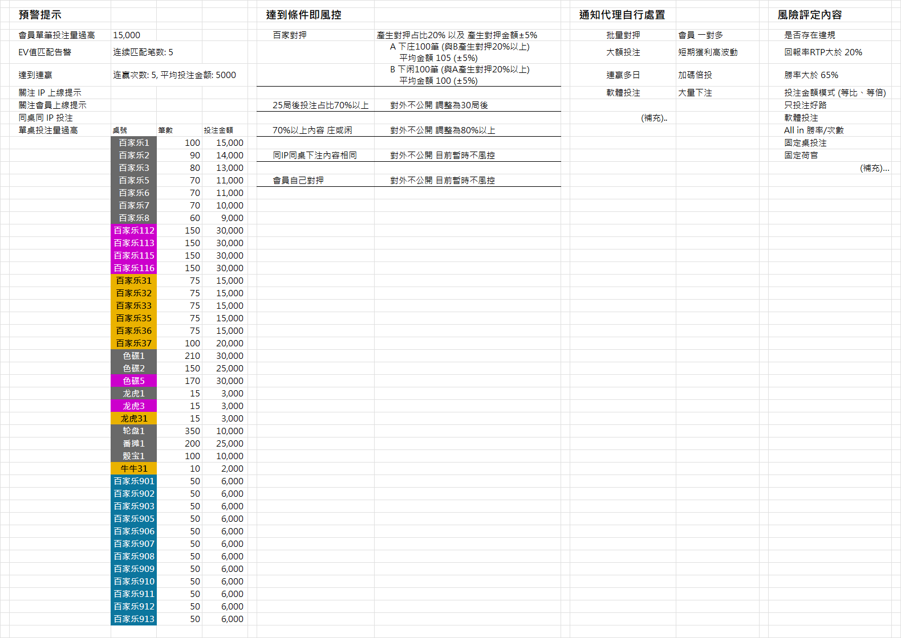

# 第一部、需求

## 1. 需求（原文）内容

```
@Humbertsand 

我能想在後台系統可以做到
1. 風險告警 → 2. 告警內容報告 → 3. 報告評級 → 4. 人工審核/執行

風險告警 Stam 擴建中

2、3、4、步驟透過風險之眼系統完成

  -風險之眼系統 (玩家詳情)
    填入玩家ID → 提示觸及告警規則 → 點擊告警規則生成詳細注單報告以及告警標記 → 彙總報告/評級 → 人工審核/執行

  -風險之眼系統 (風控候選玩家)
    點擊 "玩家暱稱" 會跳轉到 "玩家詳情"
    這功能我的理解像似 "模糊搜尋風險玩家"
    如果功能跟我理解的一致
    添加搜尋條件可以縮短人工審核成本
  條件:
    日期/時間
    產生對押筆數/占比
    產生對押金額/占比
    後段訂單數/後段訂單占比
    荷官編號/勝率
    好路投注/占比
    開牌機率/占比
    期望值/占比
(開放補充)..

  -風險之眼系統 (後段下注)
    點擊 "玩家暱稱" 會跳轉到 "玩家詳情"
    這功能我的理解像似 "模糊搜尋風險玩家"
    可以跟 "風控候選玩家" 合併

  -風險之眼系統 (玩家—荷官关联)
    點擊 "玩家暱稱" 會跳轉到 "玩家詳情"
    這功能我的理解像似 "模糊搜尋風險玩家"
    可以跟 "風控候選玩家" 合併

  -風險之眼系統 (同桌對打)
    點擊 "玩家暱稱" 會跳轉到 "玩家詳情"
    添加統一幣別按鈕

————————————————-

所以
觸發風控 取決於使用者用什麼規則條件搜尋

風控評級
需要我們再討論
```

```
風控告警項目很多
我舉例主要的

達到盈利金額
單筆注單額警告
EV值匹配告警
同桌同IP
達到連贏
```



## 2. 提问

```
1. 时效
目前数据同步会延迟1个小时。
2. 预警提示怎么计算
单笔投注量过高，是单笔订单超过15,000，还是同一局的投注总额超过15,000？
EV值匹配，EV具体怎么算？
连赢5次，中间如果出现和局，算不算中断？连续5次是按订单算，还是按局算？平均投注5,000是不是只算这段连赢期间？
关注IP和关注会员上线，关注名单由谁维护？“上线”是登录成功、进入游戏，还是第一次下注？
同桌同IP投注，这里的同IP是完整IP一样，还是同一个网段也算？
单桌投注量过高，是某一桌某一局总投注太高，还是一段时间某一桌内累计投注太高？金额阈值是多少？
3. 达到条件即风控的规则
百家乐对押定义：同一桌、同一局里，A投庄、B投闲，或者A投闲、B投庄？统计窗口是否按最近7天？
后段投注：是否需要最低总订单数、最低后段订单数和最低后段投注占比？
80%投注庄或闲，是否只统计百家乐？这个80%是按订单数、局数还是投注金额算？最低要有多少有效订单才算？
4. 通知代理处置
软件投注怎么判断？是看下注时间很固定、某一时间段 内订单数量不正常？
```

# 第二部、规范

## 1. 需求目标

本需求用于建设后台风控闭环，将现有的**风险告警（Stam）**与**风险之眼系统**串联起来，实现：

> **风险规则触发 → 风险告警 → 告警详情 → 注单/行为报告 → 风险评定 → 人工审核 → 人工执行 → 处置结果留痕**

其中：

* **风险告警 Stam**：负责风险规则的触发、告警产生与告警状态管理。
* **风险之眼**：负责风险事件的查看、玩家风险分析、详细报告、风险评定及人工审核/执行。
* **人工审核/执行**：负责最终业务判断与实际处置。
* **规则引擎**：负责根据预先配置的风险规则自动产生告警。

> **重要原则：**
>
> 风控告警的产生不应依赖人工搜索。
>
> 人工搜索属于「主动检索/补充发现」机制；自动规则命中属于「主动风控触发」机制。两者必须并存。

---

## 2. 整体业务流程

系统整体建议采用以下闭环：

```text
                    ┌────────────────────┐
                    │   风控规则引擎      │
                    │  自动计算/规则匹配   │
                    └─────────┬──────────┘
                              │
                              ▼
                    ┌────────────────────┐
                    │   风险告警 Stam     │
                    │  产生风险告警事件    │
                    └─────────┬──────────┘
                              │
                              ▼
                    ┌────────────────────┐
                    │     风险之眼        │
                    │                    │
                    │ 玩家详情            │
                    │ 风险候选玩家        │
                    │ 风险行为检索        │
                    └─────────┬──────────┘
                              │
                              ▼
                    ┌────────────────────┐
                    │    告警详细报告     │
                    │                    │
                    │ 告警规则            │
                    │ 命中条件            │
                    │ 注单明细            │
                    │ 行为统计            │
                    │ 关联关系            │
                    └─────────┬──────────┘
                              │
                              ▼
                    ┌────────────────────┐
                    │     风险评定        │
                    │ 规则评分/风险等级    │
                    └─────────┬──────────┘
                              │
                              ▼
                    ┌────────────────────┐
                    │    人工审核/执行     │
                    │                    │
                    │ 通过                │
                    │ 持续观察            │
                    │ 限制                │
                    │ 其他业务处置         │
                    └─────────┬──────────┘
                              │
                              ▼
                    ┌────────────────────┐
                    │   处置结果与审计留痕 │
                    └────────────────────┘
```

---

## 3. 系统职责边界

### 3.1 风险告警 Stam

主要负责：

1. 风险规则执行；
2. 风险条件判断；
3. 告警事件生成；
4. 告警等级/类型记录；
5. 告警时间记录；
6. 告警命中的具体条件记录；
7. 告警状态管理；
8. 将风险告警送入风险之眼。

Stam 不应承担完整的人工调查工作。

---

### 3.2 风险之眼

风险之眼作为主要的人工风控工作台，负责：

1. 玩家风险查询；
2. 告警查询；
3. 告警详情查看；
4. 注单报告生成；
5. 风险行为汇总；
6. 风险关联分析；
7. 风险评定；
8. 人工审核；
9. 人工执行；
10. 处置结果记录；
11. 审核历史及操作审计。

---

## 4. 风控触发机制

系统应同时支持两种风险发现机制。

### 4.1 自动规则触发

由风险规则引擎自动执行。

当玩家行为达到规则设定条件时：

```text
玩家行为
  ↓
规则计算
  ↓
达到条件
  ↓
产生风险告警
  ↓
进入风险之眼
```

这是正式的**自动风控触发机制**。

---

### 4.2 人工主动检索

风控人员可以在风险之眼中通过筛选条件主动寻找风险玩家。

例如：

* 日期/时间；
* 对押笔数；
* 对押占比；
* 对押金额；
* 对押金额占比；
* 后段订单数；
* 后段订单占比；
* 荷官编号；
* 荷官胜率；
* 好路投注；
* 好路投注占比；
* 开牌概率；
* 开牌概率占比；
* 期望值；
* 期望值占比；
* 其他风险指标。

人工搜索属于：

> **主动风险检索 / 风控候选发现**

而不是自动规则触发本身。

---

## 5. 风险告警类型

目前需求中明确提出的主要风险告警包括：

1. 达到盈利金额；
2. 单笔注单额警告；
3. EV 值匹配告警；
4. 同桌同 IP；
5. 达到连赢；
6. 对押；
7. 后段下注；
8. 玩家—荷官关联；
9. 同桌对打；
10. 软件投注；
11. 大量下注；
12. 其他待补充风险规则。

其中：

> 「达到盈利金额」属于原始业务需求提出的风险项目，但附件当前未提供明确阈值，因此暂列为**待配置规则**，不得擅自推定具体金额。

---

## 6. 附件中的预警提示规则

根据目前提供的后台规则表，预警提示至少包括以下项目。

| 预警项目       |                当前条件 | 状态  |
| ---------- | ------------------: | --- |
| 会员单笔投注量过高  |              15,000 | 已提出 |
| EV 值匹配告警   |            连续匹配笔数：5 | 已提出 |
| 达到连赢       | 连赢次数：5；平均投注金额：5,000 | 已提出 |
| 关注 IP 上线提示 |             未提供具体阈值 | 待确认 |
| 关注会员上线提示   |             未提供具体阈值 | 待确认 |
| 同桌同 IP 投注  |       有相关规则，但当前暂不风控 | 已提出 |
| 达到盈利金额     |             未提供金额阈值 | 待确认 |

> 上述数字来自目前提供的业务规则截图，应作为**初始规则参数**进入规则配置；正式上线前仍需由业务方确认。

---

## 7. 达到条件即风控

附件明确存在「达到条件即风控」区域。

### 7.1 百家对押

当前规则：

> 产生对押占比 ≥ 20%，以及产生对押金额达到 ±5% 条件。

其中附件进一步给出：

#### A 条件

```text
下注量 ≥ 100 单
且
产生对押 ≥ 20%
且
平均金额约 105（±5%）
```

#### B 条件

```text
下注量 ≥ 100 单
且
产生对押 ≥ 20%
且
平均金额约 100（±5%）
```

正式开发前必须进一步确认：

* 「产生对押金额 ±5%」的数学定义；
* 平均金额的计算分母；
* A/B 条件之间的关系；
* A/B 是否属于不同风险类型；
* 金额是否已经统一币别；
* 四舍五入规则；
* NULL / 0 的业务含义。

---

### 7.2 后段投注

附件规则：

```text
后段投注占比 ≥ 70%
```

达到条件后：

> 对外不公开，调整为 30 局后。

此处「30 局后」的具体业务含义需要产品/风控确认，包括：

* 是观察窗口延迟 30 局；
* 是处罚/限制持续 30 局；
* 还是重新计算风险指标；
* 是否对玩家可见。

在定义确认前不得由开发人员自行解释。

---

### 7.3 70% 以上内容庄或闲

附件规则：

```text
70% 以上内容庄或闲
```

达到条件后：

> 对外不公开，调整为 80% 以上。

该规则应明确记录：

* 庄/闲方向；
* 统计局数；
* 分子；
* 分母；
* 70% 的计算方式；
* 80% 调整的实际业务动作。

---

### 7.4 同 IP 同桌下注内容相同

附件明确标注：

> 对外不公开，目前暂时不风控。

因此当前状态应为：

```text
规则存在
≠
规则启用
```

系统应支持：

```text
规则状态 = disabled
```

并保留未来启用能力。

---

### 7.5 会员自己对押

附件明确标注：

> 对外不公开，目前暂时不风控。

同样应作为：

```text
规则已定义
规则暂不启用
```

处理，而不是删除该规则。

---

## 8. 通知代理自行处置

附件目前列出的通知/处置事项包括：

* 批量对押；
* 大额投注；
* 连赢多日；
* 软件投注；
* 大量下注；
* 其他待补充项目。

这些项目建议定义为：

> **处置建议 / 通知代理事项**

而不是直接定义为：

> **自动违规判定**

系统应允许风险人员看到：

```text
风险事件
    ↓
风险规则命中
    ↓
建议处置
    ↓
人工确认
    ↓
实际执行
```

避免将「系统发现风险」错误等同于「已经确认违规」。

---

## 9. 风险评定内容

附件目前提出的风险评定内容包括：

### 9.1 会员一对多

用于观察：

* 一个玩家对应多个关联对象；
* 多玩家之间的行为关联；
* 可能存在的团伙行为。

---

### 9.2 短期获利高波动

重点观察：

* 短期盈利；
* 盈利波动；
* 投注金额；
* 投注频率；
* 胜率；
* RTP；
* EV；
* 行为变化。

---

### 9.3 加码倍投

观察：

* 投注金额序列；
* 连续加码；
* 倍投比例；
* 金额变化；
* 连输/连赢后的下注变化。

---

### 9.4 投注金额模式

包括：

* 等比；
* 等倍；
* 固定金额；
* 其他异常金额模式。

---

### 9.5 只投注好路

观察：

* 好路投注笔数；
* 好路投注占比；
* 好路与普通投注的差异；
* 是否长期集中投注特定结果。

---

### 9.6 软件投注

观察：

* 投注时间间隔；
* 操作频率；
* 投注序列；
* 自动化行为特征；
* 异常稳定性。

---

### 9.7 All in 胜率 / 次数

建议同时展示：

* All in 次数；
* All in 胜率；
* All in 金额；
* All in 盈亏；
* All in 占总投注比例。

---

### 9.8 固定桌投注

观察：

* 固定桌数量；
* 固定桌投注占比；
* 固定桌停留时间；
* 是否长期集中于特定桌台。

---

### 9.9 固定荷官

观察：

* 荷官数量；
* 单一荷官投注占比；
* 荷官胜率；
* 荷官与玩家行为关联。

---

### 10. 风险之眼 — 玩家详情

玩家详情是整个风控流程的核心页面。

操作流程：

```text
输入玩家 ID
    ↓
查询玩家
    ↓
显示当前风险状态
    ↓
显示已命中的风险告警
    ↓
点击具体告警规则
    ↓
生成详细注单报告
    ↓
生成风险行为汇总
    ↓
风险评定
    ↓
人工审核/执行
```

玩家详情至少应包含：

#### 基本信息

* 玩家 ID；
* 玩家昵称；
* 帐号状态；
* 注册时间；
* 最近活动时间；
* 币别。

#### 风险信息

* 当前风险状态；
* 风险告警数量；
* 命中的规则；
* 首次命中时间；
* 最近命中时间；
* 当前处置状态。

#### 投注信息

* 投注笔数；
* 投注金额；
* 盈亏；
* 胜率；
* RTP；
* EV；
* 投注时间分布。

#### 风险行为

* 对押；
* 后段下注；
* 同桌；
* 同 IP；
* 荷官关联；
* 好路投注；
* All in；
* 固定金额；
* 加码倍投；
* 软件投注特征。

---

## 11. 风险之眼 — 风控候选玩家

「风控候选玩家」应作为人工主动检索入口。

建议将以下功能统一：

* 风控候选玩家；
* 后段下注；
* 玩家—荷官关联。

三者不建议各自建立完全独立的玩家列表页面。

统一设计为：

> **风险候选玩家 / 风险行为检索**

通过筛选条件切换风险类型。

---

### 11.1 搜索条件

支持：

#### 时间

* 日期；
* 时间范围。

#### 对押

* 对押笔数；
* 对押笔数占比；
* 对押金额；
* 对押金额占比。

#### 后段下注

* 后段订单数；
* 后段订单占比。

#### 荷官

* 荷官编号；
* 荷官胜率；
* 单一荷官投注占比。

#### 好路

* 好路投注笔数；
* 好路投注占比。

#### 开牌

* 开牌次数；
* 开牌概率；
* 开牌概率占比。

#### EV

* EV；
* EV 占比；
* EV 匹配次数；
* EV 匹配率。

#### 其他

* 投注金额；
* 盈利金额；
* 连赢次数；
* 投注频率；
* 同桌玩家；
* IP；
* 币别。

---

## 12. 风险候选玩家操作

列表中的：

> **玩家昵称**

应为可点击入口。

点击后：

```text
风险候选玩家
      ↓
玩家昵称
      ↓
玩家详情
```

并且应自动携带当前搜索条件，使风控人员进入玩家详情后可以知道：

> 「这个玩家为什么会出现在候选名单里？」

因此玩家详情应明确显示：

```text
候选来源
命中条件
命中数值
规则阈值
统计期间
```

例如：

```text
来源：后段下注
条件：后段投注占比 ≥ 70%
实际值：78.6%
统计局数：100
命中时间：2026-08-24 14:20:15
```

---

## 13. 风险之眼 — 同桌对打

「同桌对打」页面应重点用于发现玩家之间的异常关系。

至少支持：

* 玩家；
* 同桌玩家；
* 同桌局数；
* 同桌次数；
* 同桌投注金额；
* 同桌投注占比；
* 相同投注内容；
* 同 IP；
* 同时间段；
* 关联关系。

玩家昵称点击后进入：

> 玩家详情

---

### 13.1 统一币别

同桌对打页面增加：

> **统一币别**

按钮。

所有金额类统计在比较前必须明确：

```text
原始币别
→
统一币别
→
统计金额
```

不得在未定义汇率或换算规则的情况下直接比较不同币别金额。

---

## 14. 告警详细报告

点击玩家详情中的具体风险规则后，应生成：

> **告警详细报告**

报告至少包含：

### 14.1 告警基本资料

* 告警 ID；
* 玩家 ID；
* 玩家昵称；
* 风险规则 ID；
* 风险规则名称；
* 命中时间；
* 统计期间；
* 规则版本；
* 当前状态。

### 14.2 命中条件

必须明确显示：

```text
规则阈值
实际值
比较运算
是否命中
```

例如：

```text
规则：单笔投注量过高
阈值：15,000
实际值：30,000
结果：命中
```

---

## 15. 注单报告

告警报告应能够向下钻取至原始注单。

至少包含：

* 注单 ID；
* 玩家 ID；
* 时间；
* 桌号；
* 局号；
* 荷官；
* 投注内容；
* 投注金额；
* 输赢；
* 币别；
* IP；
* 对押关系；
* 后段标记；
* EV；
* RTP；
* 风险标签。

原则：

> **风险结论必须能够回溯至原始注单。**

不能只展示最终评分而没有证据链。

---

## 16. 风险汇总报告

玩家层面应生成统一风险摘要：

```text
玩家
├── 基本资料
├── 盈利
├── 投注
├── EV
├── RTP
├── 胜率
├── 连赢
├── 对押
├── 后段下注
├── 同桌关系
├── IP 关系
├── 荷官关系
├── 好路投注
├── All in
├── 固定金额
├── 加码倍投
└── 软件投注
```

并汇总：

* 命中规则数；
* 风险行为数；
* 关联玩家数；
* 关联荷官数；
* 关联 IP 数；
* 风险事件时间轴。

---

## 17. 风险评定

目前业务方明确表示：

> 风控评级需要进一步讨论。

因此第一阶段不应擅自规定最终评级算法。

但是系统必须预留评级能力。

建议先建立：

```text
风险评定
├── 命中规则
├── 风险指标
├── 指标实际值
├── 指标阈值
├── 风险证据
├── 关联关系
├── 历史告警
├── 人工判断
└── 最终风险等级
```

最终风险等级可待业务方确定后配置。

---

## 18. 人工审核 / 执行

风险评定完成后进入人工处理。

建议至少支持：

```text
待审核
↓
审核中
↓
确认风险
↓
确认无风险
↓
持续观察
↓
执行处置
↓
已完成
```

具体处置方式由业务规则决定。

人工操作必须记录：

* 操作人员；
* 操作时间；
* 原风险状态；
* 新风险状态；
* 操作类型；
* 操作理由；
* 备注；
* 相关规则；
* 相关告警。

---

## 19. 风险规则配置中心

附件中的阈值不应直接写死在前端。

建议建立规则配置中心。

每条规则至少包含：

| 字段             | 说明                |
| -------------- | ----------------- |
| rule_id        | 风险规则 ID           |
| rule_name      | 风险规则名称            |
| rule_type      | 预警 / 风控 / 通知 / 检索 |
| condition      | 条件                |
| threshold      | 阈值                |
| unit           | 单位                |
| currency       | 币别                |
| status         | 启用 / 停用           |
| effective_from | 生效时间              |
| effective_to   | 失效时间              |
| version        | 规则版本              |
| action         | 命中后的动作            |
| visibility     | 对外 / 对内           |
| description    | 规则说明              |

---

## 20. 规则状态

特别需要区分：

```text
规则存在
规则启用
规则命中
产生告警
进入风控
通知代理
人工确认
执行处置
```

这些不是同一个状态。

例如附件中的：

> 同 IP 同桌下注内容相同 → 目前暂时不风控

应该表示：

```text
规则存在 = TRUE
规则启用 = FALSE
```

而不是删除规则。

---

## 21. 风险事件状态模型

建议风险事件至少包含：

```text
NEW
  ↓
OPEN
  ↓
UNDER_REVIEW
  ↓
CONFIRMED / REJECTED / OBSERVATION
  ↓
ACTION_REQUIRED
  ↓
ACTIONED
  ↓
CLOSED
```

其中：

* `NEW`：系统新产生；
* `OPEN`：等待查看；
* `UNDER_REVIEW`：人工审核中；
* `CONFIRMED`：确认存在风险；
* `REJECTED`：确认不成立；
* `OBSERVATION`：持续观察；
* `ACTION_REQUIRED`：需要执行处置；
* `ACTIONED`：已经执行；
* `CLOSED`：事件关闭。

---

## 22. 关键数据审计要求

所有风险告警必须能够回答：

1. **为什么触发？**
2. **哪个规则触发？**
3. **规则当时的阈值是多少？**
4. **实际值是多少？**
5. **使用了哪一批数据？**
6. **统计时间范围是什么？**
7. **规则版本是什么？**
8. **最终是谁审核？**
9. **做了什么处置？**
10. **什么时候处置？**

因此风险告警不得只保存：

```text
玩家 ID + 风险等级
```

而必须保存：

```text
玩家
+
规则
+
规则版本
+
阈值
+
实际值
+
统计窗口
+
证据
+
告警
+
人工判断
+
处置
+
审计日志
```

---

## 23. 第一阶段建议实现范围

### P0 — 必须先完成

#### 风险告警

* 自动规则触发；
* 告警列表；
* 告警状态；
* 命中规则；
* 命中数值；
* 告警时间。

#### 玩家详情

* 玩家基本资料；
* 风险告警；
* 注单；
* 风险行为；
* 风险汇总。

#### 告警报告

* 告警详情；
* 注单明细；
* 风险证据；
* 规则阈值；
* 实际值。

#### 人工审核

* 审核；
* 风险确认；
* 驳回；
* 持续观察；
* 处置；
* 审计记录。

---

## 24. P1 — 风控效率提升

* 风控候选玩家；
* 多条件搜索；
* 后段下注筛选；
* 荷官关联筛选；
* 同桌关系；
* 同 IP；
* 好路投注；
* EV；
* RTP；
* 连赢；
* 加码倍投；
* 固定投注；
* 软件投注。

---

## 25. P2 — 高阶风险分析

* 玩家一对多；
* 玩家团伙关系；
* IP 关系图；
* 桌台关系图；
* 荷官关系图；
* 时间序列行为；
* 风险行为聚类；
* 风险评分模型；
* 风险趋势；
* 自动风险评级。

---

## 26. 当前需求中的待确认事项

以下事项不能由开发自行解释，必须由业务/风控确认。

### 26.1 盈利金额

* 达到多少金额触发？
* 统计周期？
* 单日还是累计？
* 使用何种币别？

### 26.2 EV 匹配

* 「连续匹配 5 次」的精确定义；
* EV 的计算公式；
* 匹配误差范围；
* 是否按局计算。

### 26.3 连赢

当前附件：

```text
连赢次数：5
平均投注金额：5,000
```

需确认：

* 两个条件是否必须同时满足；
* 平均金额统计窗口；
* 连赢是否按自然日重置。

### 26.4 对押

需确认：

* 对押定义；
* 对押金额；
* 对押比例；
* A/B 条件；
* ±5% 的计算方式；
* 最小样本量。

### 26.5 后段下注

需确认：

* 后段的定义；
* 70% 的分母；
* 统计局数；
* 「30 局后」的具体动作。

### 26.6 庄/闲集中投注

需确认：

* 70% 的统计窗口；
* 庄/闲是否分别计算；
* 80% 调整是什么业务动作。

### 26.7 风险评级

需确认：

* 风险等级数量；
* 各级定义；
* 是否规则加权；
* 是否允许人工覆盖系统评级；
* 人工覆盖是否必须填写理由。

---

## 27. RED TEAM — 当前需求必须避免的设计错误

### 错误一：把人工搜索当成风控触发

错误：

```text
使用者搜索
→ 触发风控
```

正确：

```text
自动规则
→ 风险告警

人工搜索
→ 风险候选发现
```

---

### 错误二：把「命中规则」直接定义成「违规」

正确模型应为：

```text
规则命中
≠
确认违规
```

而是：

```text
规则命中
→ 风险告警
→ 风险报告
→ 人工审核
→ 风险判断
→ 处置
```

---

### 错误三：把暂不风控的规则删除

附件已经明确存在：

* 同 IP 同桌下注内容相同；
* 会员自己对押。

但当前暂不风控。

因此：

```text
存在 ≠ 启用
```

必须保留规则。

---

### 错误四：把阈值写死在前端

例如：

```text
if bet_amount >= 15000
```

不应成为前端永久逻辑。

应由规则配置中心控制：

```text
rule_id
threshold
operator
unit
effective_time
version
status
```

---

### 错误五：风险报告没有证据链

不能只有：

```text
玩家：XXX
风险：高
```

必须能够逐级追溯：

```text
风险等级
↓
风险事件
↓
命中规则
↓
阈值
↓
实际值
↓
统计窗口
↓
注单
↓
原始数据
```

---

## 28. 最终需求定义

本系统最终目标不是单纯建设一个「风险玩家搜索页面」，而是建立完整的：

> **自动风控告警 + 风险调查 + 风险评定 + 人工审核 + 人工处置 + 全链路审计**

闭环。

最终业务架构定义为：

```text
                 【风险数据】
                      │
                      ▼
                 【规则引擎】
                      │
          ┌───────────┴───────────┐
          │                       │
          ▼                       ▼
     自动风险告警             人工主动检索
          │                       │
          └───────────┬───────────┘
                      ▼
                【风险之眼】
                      │
          ┌───────────┼───────────┐
          │           │           │
          ▼           ▼           ▼
       玩家详情    风险报告    关联分析
          │           │           │
          └───────────┼───────────┘
                      ▼
                  【风险评定】
                      │
                      ▼
                  【人工审核】
                      │
                      ▼
                  【人工执行】
                      │
                      ▼
                【结果与审计】
```

**第一阶段应优先把「规则命中 → 告警 → 玩家详情 → 证据报告 → 人工审核 → 处置留痕」打通。**

风险评级算法、复杂团伙模型及高级行为模型可以后置，但数据结构与审计链必须从第一阶段就预留。


